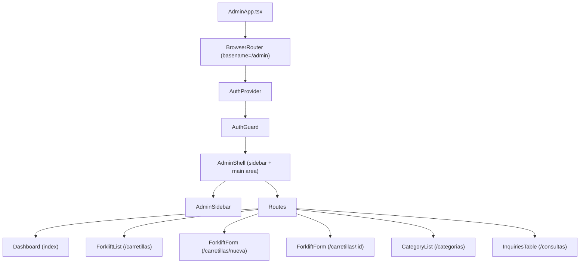

# Admin Panel Views -- Tekon Website Rewrite

## Overview

- Six React Router views inside a single `AdminApp.tsx` SPA: Dashboard, Forklift List, Forklift Form (create/edit), Category Management, and Inquiries Management
- All views share a persistent sidebar layout and are protected by `AuthGuard`
- UI built entirely with shadcn/ui components; state management uses React 19 features (`useOptimistic`, `useActionState`, `useTransition`)
- Data access through the Supabase client with RLS; uploads go to Supabase Storage
- Target audience: single non-technical admin user who should add a new forklift in under 2 minutes

## Key Concepts

- **AdminApp SPA**: A single React application mounted via `client:only="react"` on the Astro catch-all page `src/pages/admin/[...path].astro`. React Router handles all `/admin/*` navigation client-side.
- **Optimistic updates**: `useOptimistic` provides instant visual feedback for toggles (e.g., publish/unpublish) before the server response arrives.
- **Action state forms**: `useActionState` (React 19) manages form submission state (pending, error, success) declaratively, replacing manual `useState` + `try/catch` patterns.
- **Slug auto-generation**: Converts the forklift name to a URL-safe slug (lowercase, hyphens for spaces, strip accents) in real time as the user types.
- **EAV specs pattern**: Forklift specifications are stored as individual rows in `forklift_specs` (name/value/unit), allowing the admin to add arbitrary spec types without schema changes.
- **Spec name autocomplete**: When adding a new spec row, the spec name field suggests existing spec names from the database to ensure consistency across forklifts.

## Component Hierarchy



### File mapping

| Component | File | Route |
|-----------|------|-------|
| `AdminApp` | `src/components/admin/AdminApp.tsx` | -- (root SPA) |
| `AdminSidebar` | `src/components/admin/AdminSidebar.tsx` | -- (persistent) |
| `Dashboard` | `src/components/admin/Dashboard.tsx` | `/admin` |
| `ForkliftList` | `src/components/admin/ForkliftList.tsx` | `/admin/carretillas` |
| `ForkliftForm` | `src/components/admin/ForkliftForm.tsx` | `/admin/carretillas/nueva` and `/admin/carretillas/:id` |
| `SpecsEditor` | `src/components/admin/SpecsEditor.tsx` | -- (subcomponent of ForkliftForm) |
| `CategoryList` | `src/components/admin/CategoryList.tsx` | `/admin/categorias` |
| `InquiriesTable` | `src/components/admin/InquiriesTable.tsx` | `/admin/consultas` |

---

## TypeScript Interfaces

```typescript
// Shared database types used across admin views

interface Category {
  id: string
  name: string
  slug: string
  sort_order: number
}

interface Forklift {
  id: string
  name: string
  slug: string
  category_id: string
  description: string
  short_description: string
  image_url: string | null
  catalog_pdf_url: string | null
  available_for_sale: boolean
  available_for_rental: boolean
  available_as_used: boolean
  is_published: boolean
  created_at: string
  updated_at: string
}

interface ForkliftWithCategory extends Forklift {
  categories: { name: string }
}

interface ForkliftSpec {
  id: string
  forklift_id: string
  spec_name: string
  spec_value: string
  spec_unit: string | null
  sort_order: number
}

interface Inquiry {
  id: string
  name: string
  email: string
  message: string
  forklift_id: string | null
  read: boolean
  created_at: string
  forklifts: { name: string } | null
}

// Form-specific types

interface ForkliftFormData {
  name: string
  slug: string
  category_id: string
  description: string
  short_description: string
  image: File | null
  catalog_pdf: File | null
  available_for_sale: boolean
  available_for_rental: boolean
  available_as_used: boolean
  is_published: boolean
}

interface SpecRow {
  id: string          // client-side temp ID for new rows, database ID for existing
  spec_name: string
  spec_value: string
  spec_unit: string
  sort_order: number
  isNew?: boolean     // true for rows not yet persisted
  isDeleted?: boolean // true for rows marked for deletion on save
}
```

---

## 1. Admin Sidebar

### Purpose

- Persistent navigation visible on all admin views
- Shows current route as active
- Provides sign-out action

### Layout

- Fixed left sidebar, 240px wide
- Logo/title at top ("Tekon Admin")
- Navigation links with icons
- Sign-out button at bottom

### Navigation items

| Label | Route | Icon |
|-------|-------|------|
| Dashboard | `/admin` | `LayoutDashboard` |
| Carretillas | `/admin/carretillas` | `Truck` |
| Categorias | `/admin/categorias` | `FolderOpen` |
| Consultas | `/admin/consultas` | `MessageSquare` |

### Components used

- `Button` (variant="ghost" for nav links, variant="outline" for sign-out)
- `Badge` (unread inquiry count next to "Consultas" link)

### State

- Active route detected via `useLocation()` from React Router
- Unread inquiry count fetched once on mount and updated via Supabase realtime or polling

---

## 2. Dashboard (`/admin`)

### Purpose

- Landing page after login
- Shows key metrics at a glance: forklift count and unread inquiry count
- Quick-access links to common actions

### Layout

```
+----------------------------------+
|  Dashboard                       |
+----------------------------------+
|  [Card: Carretillas]  [Card: Consultas sin leer]  |
|   42                    3                          |
+----------------------------------+
|  (optional: recent activity)     |
+----------------------------------+
```

### Data queries

```typescript
// Forklift count
const { count: forkliftCount } = await supabase
  .from('forklifts')
  .select('*', { count: 'exact', head: true })

// Unread inquiry count
const { count: unreadCount } = await supabase
  .from('inquiries')
  .select('*', { count: 'exact', head: true })
  .eq('read', false)
```

### User interactions

- Click on forklift count card navigates to `/admin/carretillas`
- Click on unread inquiries card navigates to `/admin/consultas`

### Components used

- `Card`, `CardHeader`, `CardTitle`, `CardContent` (for stat cards)
- `Skeleton` (while counts load)

### State management

- `useState` for count values
- `useEffect` to fetch on mount
- Loading state with `Skeleton` placeholders

---

## 3. Forklift List (`/admin/carretillas`)

### Purpose

- Browse, search, filter, and manage all forklifts (published and unpublished)
- Quick publish/unpublish toggle without opening the edit form
- Entry point for creating and editing forklifts

### Layout

```
+--------------------------------------------------+
|  Carretillas                    [+ Nueva carretilla] |
+--------------------------------------------------+
|  [Search input]    [Category filter dropdown]     |
+--------------------------------------------------+
|  Name | Category | Status | Sale | Rental | Actions |
|  -----|----------|--------|------|--------|---------|
|  S100 | Apiladores | [Switch ON] | Yes | Yes | Edit Delete |
|  T200 | Transpaletas | [Switch OFF] | No | Yes | Edit Delete |
+--------------------------------------------------+
```

### Data query

```typescript
const { data: forklifts } = await supabase
  .from('forklifts')
  .select('*, categories(name)')
  .order('created_at', { ascending: false })
```

### Filtering and search

- **Search**: Client-side filter on `name` and `short_description` fields (the dataset is small, ~30 items)
- **Category filter**: Dropdown populated from `categories` table, filters the list client-side
- Both filters apply simultaneously

### User interactions

| Action | Behavior |
|--------|----------|
| Click "+ Nueva carretilla" | Navigate to `/admin/carretillas/nueva` |
| Click row or "Edit" button | Navigate to `/admin/carretillas/:id` |
| Toggle publish switch | Optimistic update via `useOptimistic`, then Supabase `update` |
| Click "Delete" button | Confirmation dialog, then Supabase `delete` + remove from list |
| Type in search input | Debounced client-side filter (300ms) |
| Select category in dropdown | Instant client-side filter |

### Publish toggle (optimistic)

```typescript
const [optimisticForklifts, updateOptimistic] = useOptimistic(
  forklifts,
  (current, { id, is_published }: { id: string; is_published: boolean }) =>
    current.map((f) => (f.id === id ? { ...f, is_published } : f))
)

const handleTogglePublish = async (id: string, newValue: boolean) => {
  startTransition(() => {
    updateOptimistic({ id, is_published: newValue })
  })
  const { error } = await supabase
    .from('forklifts')
    .update({ is_published: newValue })
    .eq('id', id)
  if (error) {
    // Revert: re-fetch the list
    refetchForklifts()
  }
}
```

### Delete confirmation

```typescript
// Shows a Dialog asking "Are you sure you want to delete {forklift.name}?"
// On confirm:
const handleDelete = async (id: string) => {
  const { error } = await supabase
    .from('forklifts')
    .delete()
    .eq('id', id)
  // Also delete associated images/PDFs from storage
  // Specs are deleted automatically via ON DELETE CASCADE
}
```

### Components used

- `Table`, `TableHeader`, `TableRow`, `TableCell`, `TableBody` (forklift list)
- `Input` (search)
- `Select`, `SelectTrigger`, `SelectContent`, `SelectItem` (category filter)
- `Switch` (publish toggle)
- `Button` (create, edit, delete actions)
- `Badge` (availability tags: sale, rental, used)
- `Dialog`, `DialogContent`, `DialogHeader`, `DialogFooter` (delete confirmation)
- `Skeleton` (loading state for table rows)

### State management

- `useState` for forklifts array, search term, selected category
- `useOptimistic` for publish toggle
- `useTransition` for non-blocking publish updates
- `useEffect` for initial data fetch

---

## 4. Forklift Form (`/admin/carretillas/nueva` and `/admin/carretillas/:id`)

### Purpose

- Create a new forklift or edit an existing one
- Handles all forklift fields: metadata, descriptions, images, PDFs, availability flags, and specs
- Same component for both create and edit; detects mode via presence of `:id` param

### Layout

```
+--------------------------------------------------+
|  Nueva carretilla / Editar: S100    [Guardar] [Cancelar] |
+--------------------------------------------------+
|  [Name input]       [Slug input (auto/manual)]   |
|  [Category dropdown]                              |
|  [Short description textarea]                     |
|  [Description editor (markdown/WYSIWYG)]          |
+--------------------------------------------------+
|  [Image upload zone]    [PDF upload zone]         |
+--------------------------------------------------+
|  Availability:                                    |
|  [x] Venta  [x] Alquiler  [ ] Ocasion  [x] Publicado |
+--------------------------------------------------+
|  Especificaciones tecnicas                        |
|  +----------------------------------------------+|
|  | Name       | Value   | Unit  | Actions       ||
|  |------------|---------|-------|---------------||
|  | Capacidad  | 1000    | kg    | [drag] [delete]||
|  | Altura     | 3000    | mm    | [drag] [delete]||
|  | [+ Anadir especificacion]                    ||
|  +----------------------------------------------+|
+--------------------------------------------------+
```

### Mode detection

```typescript
const { id } = useParams()
const isEditMode = Boolean(id)

// Edit mode: fetch existing forklift + specs
// Create mode: start with empty form
```

### Data queries (edit mode)

```typescript
// Fetch forklift
const { data: forklift } = await supabase
  .from('forklifts')
  .select('*')
  .eq('id', id)
  .single()

// Fetch specs
const { data: specs } = await supabase
  .from('forklift_specs')
  .select('*')
  .eq('forklift_id', id)
  .order('sort_order', { ascending: true })

// Fetch categories (for dropdown)
const { data: categories } = await supabase
  .from('categories')
  .select('*')
  .order('sort_order', { ascending: true })
```

### Slug auto-generation

```typescript
function generateSlug(name: string): string {
  return name
    .toLowerCase()
    .normalize('NFD')                   // decompose accents
    .replace(/[\u0300-\u036f]/g, '')    // remove accent marks
    .replace(/[^a-z0-9\s-]/g, '')      // remove special chars
    .replace(/\s+/g, '-')              // spaces to hyphens
    .replace(/-+/g, '-')              // collapse multiple hyphens
    .trim()
}

// Auto-generate slug as user types name (unless slug was manually edited)
const [slugManuallyEdited, setSlugManuallyEdited] = useState(false)

const handleNameChange = (name: string) => {
  setFormData((prev) => ({
    ...prev,
    name,
    slug: slugManuallyEdited ? prev.slug : generateSlug(name),
  }))
}
```

### Form submission

```typescript
// Using useActionState (React 19)
const [state, formAction, isPending] = useActionState(
  async (prevState: FormState, formData: FormData) => {
    try {
      // 1. Upload image if changed
      let imageUrl = existingImageUrl
      const imageFile = formData.get('image') as File
      if (imageFile?.size > 0) {
        imageUrl = await uploadImage(imageFile, slug)
      }

      // 2. Upload PDF if changed
      let pdfUrl = existingPdfUrl
      const pdfFile = formData.get('catalog_pdf') as File
      if (pdfFile?.size > 0) {
        pdfUrl = await uploadPdf(pdfFile, slug)
      }

      // 3. Upsert forklift
      const forkliftData = {
        name, slug, category_id, description, short_description,
        image_url: imageUrl, catalog_pdf_url: pdfUrl,
        available_for_sale, available_for_rental, available_as_used,
        is_published,
      }

      let forkliftId: string
      if (isEditMode) {
        await supabase.from('forklifts').update(forkliftData).eq('id', id)
        forkliftId = id
      } else {
        const { data } = await supabase.from('forklifts')
          .insert(forkliftData).select('id').single()
        forkliftId = data.id
      }

      // 4. Save specs (see Specs Editor section)
      await saveSpecs(forkliftId, specRows)

      // 5. Navigate back to list
      navigate('/carretillas')
      return { success: true }
    } catch (error) {
      return { success: false, error: error.message }
    }
  },
  { success: false, error: null }
)
```

### Image upload

```typescript
async function uploadImage(file: File, slug: string): Promise<string> {
  const ext = file.name.split('.').pop()
  const fileName = `${slug}-${Date.now()}.${ext}`

  const { error } = await supabase.storage
    .from('forklift-images')
    .upload(fileName, file, { cacheControl: '3600', upsert: false })

  if (error) throw error

  const { data: { publicUrl } } = supabase.storage
    .from('forklift-images')
    .getPublicUrl(fileName)

  return publicUrl
}
```

### PDF catalog upload

```typescript
async function uploadPdf(file: File, slug: string): Promise<string> {
  const fileName = `${slug}-catalog-${Date.now()}.pdf`

  const { error } = await supabase.storage
    .from('forklift-catalogs')
    .upload(fileName, file, { cacheControl: '3600', upsert: false })

  if (error) throw error

  const { data: { publicUrl } } = supabase.storage
    .from('forklift-catalogs')
    .getPublicUrl(fileName)

  return publicUrl
}
```

### User interactions

| Action | Behavior |
|--------|----------|
| Type in name field | Auto-generates slug (unless slug was manually edited) |
| Edit slug field directly | Sets `slugManuallyEdited` flag, stops auto-generation |
| Select category from dropdown | Sets `category_id` |
| Drop image in upload zone | Preview shown, file stored for upload on save |
| Drop PDF in upload zone | File name shown, file stored for upload on save |
| Toggle availability checkboxes | Updates boolean fields in form state |
| Click "Guardar" | Runs form action: uploads files, upserts forklift, saves specs, navigates to list |
| Click "Cancelar" | Navigate back to `/admin/carretillas` without saving |

### Components used

- `Input` (name, slug)
- `Textarea` (short description)
- `Select`, `SelectTrigger`, `SelectContent`, `SelectItem` (category dropdown)
- `Button` (save, cancel)
- `Checkbox` (availability flags: sale, rental, used, published)
- `Card`, `CardContent` (image/PDF upload zones)
- `Skeleton` (loading state while fetching existing forklift in edit mode)

### State management

- `useActionState` for form submission (pending state, error state, success state)
- `useState` for form field values, spec rows, file previews
- `useEffect` for fetching forklift data and specs in edit mode
- `useTransition` for non-blocking slug generation

---

## 4.1 Specs Editor (subcomponent of Forklift Form)

### Purpose

- Dynamic table for managing forklift specifications
- Each row has: spec name, spec value, spec unit
- Rows can be added, deleted, and reordered via drag-and-drop
- Feels like editing a spreadsheet for the non-technical admin user

### Layout

```
+------------------------------------------------------+
|  Especificaciones tecnicas                            |
+------------------------------------------------------+
|  Nombre          | Valor      | Unidad  | Acciones   |
|------------------|------------|---------|------------|
|  [Capacidad v]   | [1000    ] | [kg   ] | [=] [x]   |
|  [Altura     v]  | [3000    ] | [mm   ] | [=] [x]   |
|  [Tipo        v] | [Electrico]| [     ] | [=] [x]   |
+------------------------------------------------------+
|  [+ Anadir especificacion]                            |
+------------------------------------------------------+

[=] = drag handle
[x] = delete button
[v] = autocomplete dropdown
```

### Spec name autocomplete

```typescript
// Fetch distinct spec names from existing specs for autocomplete suggestions
const { data: existingSpecNames } = await supabase
  .from('forklift_specs')
  .select('spec_name')

const uniqueSpecNames = [...new Set(existingSpecNames?.map((s) => s.spec_name))]

// Rendered as a Combobox (Input + dropdown suggestions)
// User can type freely or pick from existing names
```

### Row operations

```typescript
// Add a new empty row
const addSpecRow = () => {
  setSpecRows((prev) => [
    ...prev,
    {
      id: crypto.randomUUID(), // temp client-side ID
      spec_name: '',
      spec_value: '',
      spec_unit: '',
      sort_order: prev.length,
      isNew: true,
    },
  ])
}

// Delete a row
const deleteSpecRow = (id: string) => {
  setSpecRows((prev) =>
    prev.map((row) =>
      row.id === id ? { ...row, isDeleted: true } : row
    )
  )
}

// Update a field in a row
const updateSpecRow = (id: string, field: keyof SpecRow, value: string) => {
  setSpecRows((prev) =>
    prev.map((row) => (row.id === id ? { ...row, [field]: value } : row))
  )
}
```

### Drag-and-drop reorder

```typescript
// Using native HTML drag and drop (or a library like @dnd-kit/core)
const handleDragEnd = (result: { active: string; over: string }) => {
  const { active, over } = result
  if (active === over) return

  setSpecRows((prev) => {
    const oldIndex = prev.findIndex((r) => r.id === active)
    const newIndex = prev.findIndex((r) => r.id === over)
    const reordered = arrayMove(prev, oldIndex, newIndex)
    return reordered.map((row, i) => ({ ...row, sort_order: i }))
  })
}
```

### Saving specs to database

```typescript
async function saveSpecs(forkliftId: string, rows: SpecRow[]) {
  // 1. Delete removed rows
  const deletedIds = rows
    .filter((r) => r.isDeleted && !r.isNew)
    .map((r) => r.id)

  if (deletedIds.length > 0) {
    await supabase
      .from('forklift_specs')
      .delete()
      .in('id', deletedIds)
  }

  // 2. Upsert remaining rows (insert new, update existing)
  const activeRows = rows
    .filter((r) => !r.isDeleted)
    .map((row, index) => ({
      id: row.isNew ? undefined : row.id,
      forklift_id: forkliftId,
      spec_name: row.spec_name,
      spec_value: row.spec_value,
      spec_unit: row.spec_unit || null,
      sort_order: index,
    }))

  if (activeRows.length > 0) {
    await supabase
      .from('forklift_specs')
      .upsert(activeRows, { onConflict: 'id' })
  }
}
```

### Components used

- `Table`, `TableHeader`, `TableRow`, `TableCell`, `TableBody` (spec rows)
- `Input` (spec value, spec unit)
- `Command`, `CommandInput`, `CommandList`, `CommandItem` (spec name autocomplete / combobox)
- `Button` (add row, delete row)
- `GripVertical` icon (drag handle)

### Edge cases

- Empty spec name or value: validate on save, highlight invalid rows with red border
- Duplicate spec names on the same forklift: allowed (some forklifts may have multiple values for the same spec, e.g., "Altura de elevacion" with different mast configurations)
- Spec unit is optional (e.g., "Tipo de alimentacion: Electrico" has no unit)
- Maximum of 50 spec rows per forklift (soft limit, enforced in the UI)
- When autocomplete returns no matches, the user types freely to create a new spec name

---

## 5. Category Management (`/admin/categorias`)

### Purpose

- CRUD for forklift categories
- Inline editing (no separate form page)
- Drag-and-drop to reorder categories (controls display order on the public site)

### Layout

```
+--------------------------------------------------+
|  Categorias                     [+ Nueva categoria] |
+--------------------------------------------------+
|  [=] Apiladores electricos          [Edit] [Delete] |
|  [=] Carretillas contrabalanceadas   [Edit] [Delete] |
|  [=] Transpaletas electricas         [Edit] [Delete] |
+--------------------------------------------------+

Inline edit mode (after clicking Edit):
+--------------------------------------------------+
|  [=] [Name input: Apiladores electricos]  [Save] [Cancel] |
+--------------------------------------------------+
```

### Data query

```typescript
const { data: categories } = await supabase
  .from('categories')
  .select('*')
  .order('sort_order', { ascending: true })
```

### User interactions

| Action | Behavior |
|--------|----------|
| Click "+ Nueva categoria" | Adds an empty row at the bottom in edit mode |
| Click "Edit" on a row | Row switches to inline edit mode (input field replaces text) |
| Click "Save" on edit row | Upserts the category (generates slug from name), exits edit mode |
| Click "Cancel" on edit row | Reverts to display mode, discards changes |
| Click "Delete" on a row | Confirmation dialog; blocked if category has forklifts (FK constraint) |
| Drag and drop rows | Reorders categories, updates `sort_order` in the database |

### Create / Update

```typescript
const handleSaveCategory = async (category: Partial<Category>) => {
  const slug = generateSlug(category.name!)

  if (category.id) {
    // Update
    await supabase
      .from('categories')
      .update({ name: category.name, slug })
      .eq('id', category.id)
  } else {
    // Insert
    const maxOrder = categories.reduce((max, c) => Math.max(max, c.sort_order), 0)
    await supabase
      .from('categories')
      .insert({ name: category.name!, slug, sort_order: maxOrder + 1 })
  }

  refetchCategories()
}
```

### Delete with FK check

```typescript
const handleDeleteCategory = async (id: string) => {
  const { count } = await supabase
    .from('forklifts')
    .select('*', { count: 'exact', head: true })
    .eq('category_id', id)

  if (count && count > 0) {
    // Show error: "No se puede eliminar. Hay {count} carretillas en esta categoria."
    return
  }

  await supabase.from('categories').delete().eq('id', id)
  refetchCategories()
}
```

### Reorder

```typescript
const handleReorder = async (reorderedCategories: Category[]) => {
  const updates = reorderedCategories.map((cat, index) => ({
    id: cat.id,
    sort_order: index,
  }))

  // Batch update sort_order
  for (const update of updates) {
    await supabase
      .from('categories')
      .update({ sort_order: update.sort_order })
      .eq('id', update.id)
  }
}
```

### Components used

- `Card`, `CardContent` (list container)
- `Input` (inline name editing)
- `Button` (add, edit, save, cancel, delete)
- `Dialog`, `DialogContent`, `DialogHeader`, `DialogFooter` (delete confirmation)
- `GripVertical` icon (drag handle)
- `Alert`, `AlertDescription` (error when deleting category with forklifts)

### State management

- `useState` for categories array, editing row ID, new category name
- `useEffect` for initial fetch
- `useTransition` for reorder updates (non-blocking)

---

## 6. Inquiries Management (`/admin/consultas`)

### Purpose

- View all contact form submissions
- Mark inquiries as read/unread
- Expand to see full message
- See which forklift the inquiry is about (if any)

### Layout

```
+----------------------------------------------------------+
|  Consultas                                                |
+----------------------------------------------------------+
|  [Filter: Todas | Sin leer | Leidas]                     |
+----------------------------------------------------------+
|  [Badge:NEW] Juan Garcia | juan@example.com | S100 | 04/03/2026 |
|    (click to expand)                                       |
|    +------------------------------------------------------+
|    | Mensaje: Estoy interesado en el modelo S100...       |
|    | [Marcar como leido]                                  |
|    +------------------------------------------------------+
|  Maria Lopez | maria@example.com | -- | 03/03/2026         |
+----------------------------------------------------------+
```

### Data query

```typescript
const { data: inquiries } = await supabase
  .from('inquiries')
  .select('*, forklifts(name)')
  .order('created_at', { ascending: false })
```

### Filtering

- Three filter options: "Todas" (all), "Sin leer" (unread), "Leidas" (read)
- Client-side filtering on the `read` boolean field
- Unread count shown in badge next to "Sin leer" tab

### User interactions

| Action | Behavior |
|--------|----------|
| Click on a row | Expands to show full message text |
| Click "Marcar como leido" | Updates `read = true` via Supabase, updates badge/row styling |
| Click "Marcar como no leido" | Updates `read = false` via Supabase |
| Select filter tab | Filters inquiry list client-side |
| Click forklift name link | Navigates to `/admin/carretillas/:id` |
| Click "Eliminar" | Confirmation dialog, then deletes the inquiry |

### Mark as read/unread

```typescript
const handleToggleRead = async (id: string, currentRead: boolean) => {
  await supabase
    .from('inquiries')
    .update({ read: !currentRead })
    .eq('id', id)

  // Update local state
  setInquiries((prev) =>
    prev.map((inq) =>
      inq.id === id ? { ...inq, read: !currentRead } : inq
    )
  )
}
```

### Row styling

- Unread rows: bold text, left border accent color, `Badge` with "Nueva"
- Read rows: normal weight text, no border accent, no badge

### Components used

- `Table`, `TableHeader`, `TableRow`, `TableCell`, `TableBody` (inquiry list)
- `Tabs`, `TabsList`, `TabsTrigger`, `TabsContent` (filter tabs: all/unread/read)
- `Badge` (unread indicator "Nueva")
- `Button` (mark read/unread, delete)
- `Dialog`, `DialogContent`, `DialogHeader`, `DialogFooter` (delete confirmation)
- `Collapsible`, `CollapsibleTrigger`, `CollapsibleContent` (expand message) -- or custom expand with state

### State management

- `useState` for inquiries array, active filter tab, expanded row ID
- `useEffect` for initial fetch
- `useOptimistic` for read/unread toggle (instant visual feedback)

---

## Shared Patterns Across Views

### Loading states

- Every view shows `Skeleton` components while data is being fetched
- The forklift list shows skeleton table rows (5 rows)
- The dashboard shows skeleton cards
- The forklift form shows a full-page skeleton matching the form layout

### Error handling

- Supabase errors are caught and displayed as `Alert` components with `variant="destructive"`
- Network errors show a generic "Error de conexion" message with a retry button
- Form validation errors highlight individual fields with red borders and helper text

### Navigation

- All navigation uses React Router's `useNavigate()` and `<Link>` components
- No full page reloads within the admin SPA (except sign out, which uses `window.location.href`)
- Browser back/forward buttons work correctly via React Router

### Empty states

| View | Empty state message |
|------|-------------------|
| Forklift list | "No hay carretillas. Crea la primera." with link to create form |
| Category list | "No hay categorias. Crea la primera." with add button |
| Inquiries | "No hay consultas." |
| Search results | "No se encontraron resultados para '{query}'." |

---

## Complete shadcn/ui Component Usage

| Component | Used in |
|-----------|---------|
| `Alert`, `AlertDescription` | Error messages (all views) |
| `Badge` | Unread count (sidebar, inquiries), availability tags (forklift list) |
| `Button` | All views (actions, navigation, form submission) |
| `Card`, `CardHeader`, `CardTitle`, `CardContent` | Dashboard stat cards, upload zones, category list container |
| `Checkbox` | Forklift form (availability flags) |
| `Collapsible`, `CollapsibleTrigger`, `CollapsibleContent` | Inquiries (expand message) |
| `Command`, `CommandInput`, `CommandList`, `CommandItem` | Specs editor (spec name autocomplete) |
| `Dialog`, `DialogContent`, `DialogHeader`, `DialogFooter` | Delete confirmations (forklifts, categories, inquiries) |
| `Input` | Search, form fields, inline edit (categories), spec values |
| `Label` | Form field labels |
| `Select`, `SelectTrigger`, `SelectContent`, `SelectItem` | Category filter (forklift list), category dropdown (forklift form) |
| `Skeleton` | Loading states (all views) |
| `Switch` | Publish toggle (forklift list) |
| `Table`, `TableHeader`, `TableRow`, `TableCell`, `TableBody` | Forklift list, specs editor, inquiries list |
| `Tabs`, `TabsList`, `TabsTrigger`, `TabsContent` | Inquiry filter tabs |
| `Textarea` | Short description (forklift form) |

---

## Edge Cases and Constraints

### General

- All admin views require an authenticated session; unauthenticated access redirects to `/admin/login`
- The admin SPA uses `BrowserRouter` with `basename="/admin"`, so all routes are relative to `/admin`
- Only one admin user exists; no multi-user concurrency concerns
- If the Supabase session expires during a long editing session, the next API call fails and `AuthGuard` redirects to login

### Forklift form

- Slug uniqueness is enforced at the database level (`UNIQUE` constraint); the form should catch the Supabase error and display "Ya existe una carretilla con este slug"
- Image upload happens on form save, not on file drop (avoids orphaned uploads)
- If image upload fails, the forklift is still saved without the image; an error is shown
- Maximum image size: 5MB; maximum PDF size: 10MB (enforced client-side before upload)
- Supported image formats: JPG, PNG, WebP
- Description field can use markdown or a basic WYSIWYG editor; the public site renders it accordingly
- When editing, existing image/PDF are shown with a "Cambiar" button; dropping a new file replaces the reference

### Specs editor

- New spec rows are not persisted until the entire form is saved (batch operation)
- Deleting a spec row from a saved forklift marks it for deletion; actual delete happens on save
- If the forklift form save fails mid-way (e.g., specs fail but forklift was saved), the form stays open with the error displayed
- Empty spec rows (blank name or value) are stripped before saving
- Spec name autocomplete suggestions are fetched once on form mount, not on every keystroke

### Categories

- A category cannot be deleted if it has associated forklifts (enforced by FK constraint `ON DELETE RESTRICT` and pre-checked in the UI)
- Category slug is auto-generated from the name and must be unique
- Reordering sends multiple sequential updates; a network interruption may leave partial reorder state (mitigated by refetching after reorder)

### Inquiries

- Inquiries are never edited, only read/marked/deleted
- The `forklift_id` can be null (general inquiry not tied to a specific forklift)
- If the associated forklift is deleted, `forklift_id` is set to null via `ON DELETE SET NULL`
- Large message text is truncated in the collapsed row view (first 100 characters)

## Related Documentation

- `supabase-auth-admin.md` -- Auth flow, AuthGuard, AuthProvider, RLS policies, session management
- `supabase-setup-schema.md` -- Table schemas, storage buckets, CRUD patterns, full-text search, edge functions
