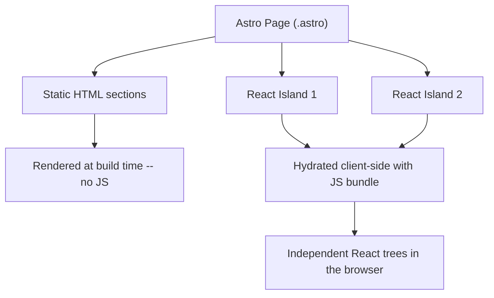
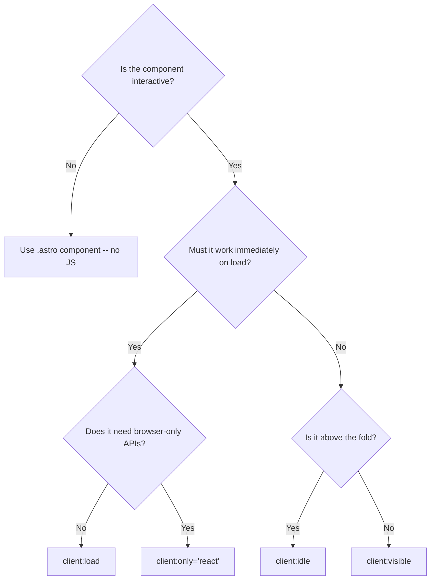
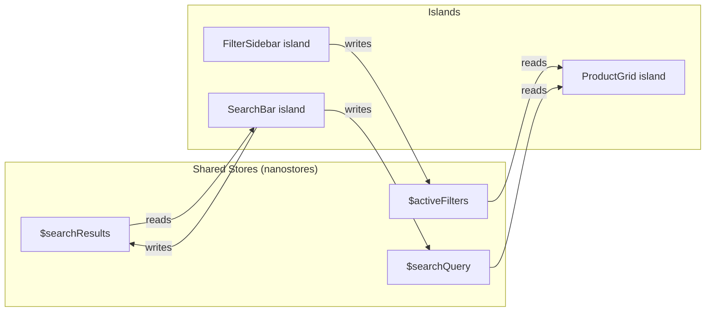
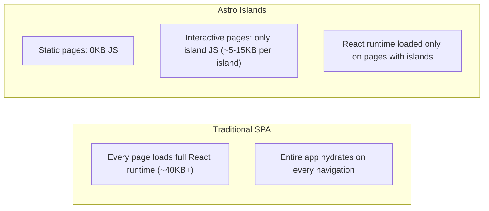

# Astro 5 + React 19 Islands -- Tekon Website

## Overview

- Astro 5 pre-renders public pages to static HTML with zero JavaScript by default
- Interactive features (search, filters, carousel, contact form, admin panel) are React 19 components hydrated client-side as "islands"
- UI layer uses shadcn/ui components inside React islands, styled with Tailwind CSS 4
- Hosted on Vercel with edge caching for static pages

## Key Concepts

- **Static-first rendering**: Astro strips all JS from pages unless explicitly opted in -- HTML and CSS only
- **Islands architecture**: Small, isolated React components embedded in otherwise static pages; each island hydrates independently
- **Hydration directives**: Astro attributes (`client:load`, `client:visible`, etc.) that control when and how a React component becomes interactive in the browser
- **Partial hydration**: Only the interactive parts of a page ship JS; static content around them remains pure HTML
- **Zero-JS pages**: Pages like `/sobre-nosotros`, `/politica-de-privacidad` ship no JavaScript at all

## Architecture



### How it works at build time and runtime

1. Astro compiles `.astro` pages to static HTML at build time
2. Static content (headers, footers, text sections, images) becomes pure HTML/CSS
3. React components marked with `client:*` directives are bundled separately
4. At runtime, Astro's island loader hydrates each React component independently
5. Each island has its own React root -- they do not share a single React tree

## Astro 5 Static Rendering

- Every `.astro` page in `src/pages/` produces a static HTML file at build time
- Astro components (`.astro` files) run only at build time -- no client-side runtime
- Data fetching in `.astro` files happens at build time via top-level `await`
- Static pages are served from Vercel's edge CDN with no server processing per request
- The Astro `<Image>` component optimizes images to WebP with responsive `srcset` at build time

### Build output

```
dist/
  index.html                          -- zero JS
  sobre-nosotros/index.html           -- zero JS
  venta-de-carretillas/index.html     -- includes island JS bundle
  carretillas/[slug]/index.html       -- includes contact form island JS
  admin/index.html                    -- full React app
```

## React 19 Islands Architecture

### What an island is

- A React component rendered inside an `.astro` page using a `client:*` directive
- Each island is a self-contained React application with its own root
- Islands can receive props from the Astro page (serialized at build time)
- Islands cannot directly access other islands' state or React context

### How islands work in Astro

```astro
---
// src/pages/index.astro
import Layout from '../layouts/Layout.astro';
import Hero from '../components/Hero.astro';        // Static -- no JS
import Carousel from '../components/Carousel';       // React island
---

<Layout>
  <Hero />                                           <!-- Static HTML -->
  <Carousel client:visible forklifts={featuredForklifts} />  <!-- React island -->
</Layout>
```

- The `Hero` component is an `.astro` file -- rendered to HTML at build, no JS shipped
- The `Carousel` is a React component with `client:visible` -- its JS loads only when it scrolls into view
- Props passed to islands must be serializable (no functions, no class instances)

## Hydration Directives

| Directive | When JS Loads | When to Use |
|-----------|--------------|-------------|
| `client:load` | Immediately on page load | Components that must be interactive right away (search bar in header, admin panel components) |
| `client:visible` | When the component scrolls into viewport | Below-the-fold components (carousel, contact form at bottom of product page) |
| `client:idle` | When browser is idle (after initial load) | Non-critical interactivity that can wait (filter sidebar, non-urgent UI) |
| `client:only="react"` | Immediately, but skips SSR entirely | Components that cannot render on server (use browser APIs like `window`, `localStorage`; admin-only components) |

### Decision guide for this project



### Directive assignments for Tekon components

| Component | Directive | Rationale |
|-----------|-----------|-----------|
| Global search (header) | `client:load` | Users expect instant search availability |
| Featured forklifts carousel | `client:visible` | Below hero, loads when scrolled into view |
| Product filter sidebar | `client:idle` | Above fold on listing pages but can wait for idle |
| Contact form | `client:visible` | Typically at bottom of page |
| Admin pages | `client:only="react"` | Full React app, uses browser APIs, no SSR needed |
| Google Map embed | `client:visible` | Below fold on contact page |

## Island Boundaries in This Project

### Static components (no JS, `.astro` files)

- `Header.astro` -- navigation, logo (search trigger is a separate island)
- `Footer.astro` -- links, contact info, copyright
- `Hero.astro` -- hero banner with CTA
- `ServiceCard.astro` -- sale/rental/used service cards on homepage
- `ForkliftCard.astro` -- static card layout (used inside React islands for interactivity)
- `SpecsTable.astro` -- static specification table on product detail pages
- All legal pages -- fully static content
- `SolutionsSection.astro` -- service sections on `/nuestras-soluciones`
- `AboutSection.astro` -- company history on `/sobre-nosotros`

### Interactive components (React islands)

- `SearchBar.tsx` -- global search with debounced Supabase full-text search
- `FeaturedCarousel.tsx` -- homepage featured forklifts carousel
- `ProductGrid.tsx` -- forklift card grid with filters on listing pages
- `FilterSidebar.tsx` -- filter controls (range sliders, checkbox groups)
- `ContactForm.tsx` -- contact/inquiry form with validation
- `AdminApp.tsx` -- single React SPA with React Router (dashboard, CRUD, inquiries)

### Page-to-island mapping

| Page | Static Sections | React Islands |
|------|----------------|---------------|
| `/` (Homepage) | Hero, service cards, about teaser, CTA | `SearchBar`, `FeaturedCarousel` |
| `/venta-de-carretillas` | Page heading, intro paragraph | `SearchBar`, `ProductGrid` + `FilterSidebar` |
| `/alquiler-de-carretillas` | Page heading, intro paragraph | `SearchBar`, `ProductGrid` + `FilterSidebar` |
| `/carretillas-de-segunda-mano` | Page heading, intro paragraph | `SearchBar`, `ProductGrid` + `FilterSidebar` |
| `/carretillas/[slug]` | Image, description, specs table, PDF link | `SearchBar`, `ContactForm` |
| `/contacto` | Address, phone, heading | `SearchBar`, `ContactForm`, Google Map |
| `/nuestras-soluciones` | All content, FAQ | `SearchBar` |
| `/sobre-nosotros` | All content | `SearchBar` |
| `/admin/*` | None | `AdminApp` (single React SPA with React Router, `client:only="react"`) |

## Sharing State Between Islands

### The problem

- Each React island has its own React root -- `useContext` does not work across islands
- URL search params and the search bar must share state across the page

### Solution: nanostores

[nanostores](https://github.com/nanostores/nanostores) is a lightweight (~1KB) state manager designed for island architectures. It works outside React's tree, so multiple islands can subscribe to the same store.

```
npm install nanostores @nanostores/react
```

### Implementation pattern

```typescript
// src/stores/searchStore.ts
import { atom } from 'nanostores';

export const $searchQuery = atom('');
export const $searchResults = atom<Forklift[]>([]);
export const $isSearchOpen = atom(false);
```

```tsx
// Inside any React island
import { useStore } from '@nanostores/react';
import { $searchQuery, $isSearchOpen } from '../stores/searchStore';

function SearchBar() {
  const query = useStore($searchQuery);
  const isOpen = useStore($isSearchOpen);
  // Both SearchBar island and any other island reading $searchQuery stay in sync
}
```

### State sharing map for this project



| Store | Written by | Read by | Purpose |
|-------|-----------|---------|---------|
| `$searchQuery` | SearchBar | ProductGrid | Current search text |
| `$searchResults` | SearchBar | SearchBar (dropdown) | Search result list |
| `$isSearchOpen` | SearchBar, Header click handler | SearchBar | Toggle search UI |
| `$activeFilters` | FilterSidebar | ProductGrid | Active filter criteria |

### URL param synchronization

- Filters are synced to URL params (`?capacidad_min=1000&tipo=electrico`) for shareable links
- On mount, FilterSidebar reads URL params and populates `$activeFilters`
- On filter change, FilterSidebar updates both the store and the URL via `history.replaceState`

## Astro Pages vs React Components

### File structure

```
src/
  pages/                          -- .astro files define routes
    index.astro                   -- Homepage
    venta-de-carretillas.astro    -- Sales listing page
    alquiler-de-carretillas.astro
    carretillas-de-segunda-mano.astro
    carretillas/[slug].astro      -- Dynamic product detail page
    contacto.astro
    sobre-nosotros.astro
    nuestras-soluciones.astro
    politica-de-privacidad.astro
    politica-de-cookies.astro
    aviso-legal.astro
    admin/
      login.astro                 -- Separate login page
      [...path].astro             -- Catch-all, mounts AdminApp SPA
  layouts/
    Layout.astro                  -- Public site layout (head, header, footer)
    AdminLayout.astro             -- Admin layout (sidebar, auth guard)
  components/
    Header.astro                  -- Static header
    Footer.astro                  -- Static footer
    Hero.astro
    ServiceCard.astro
    ForkliftCard.astro
    SpecsTable.astro
    SearchBar.tsx                 -- React island
    FeaturedCarousel.tsx          -- React island
    ProductGrid.tsx               -- React island
    FilterSidebar.tsx             -- React island
    ContactForm.tsx               -- React island
    admin/
      AdminApp.tsx                -- Single React SPA with React Router
      ForkliftForm.tsx
      InquiriesTable.tsx
      CategoryList.tsx
  stores/
    searchStore.ts                -- nanostores
    filterStore.ts                -- nanostores
  lib/
    supabase.ts                   -- Supabase client
    helpers.ts
  styles/
    global.css                    -- Tailwind imports, custom properties
```

### Rules of thumb

| File type | Runs where | Use when |
|-----------|-----------|----------|
| `.astro` page | Build time only | Defining routes, fetching data at build, composing layout |
| `.astro` component | Build time only | Static UI: headers, footers, cards, text sections |
| `.tsx` component | Client-side (browser) | Interactive UI: forms, search, filters, anything with state |
| `.ts` store | Client-side (browser) | Shared state between React islands |

### Pattern: Astro page embedding a React island (hybrid data loading)

Build-time data is passed as props for SEO (product cards in initial HTML). The React island re-fetches fresh data on mount to ensure freshness, then uses client-side filtering.

```astro
---
// src/pages/venta-de-carretillas.astro
import Layout from '../layouts/Layout.astro';
import ProductGrid from '../components/ProductGrid';
import FilterSidebar from '../components/FilterSidebar';

// Data fetched at build time — included in static HTML for SEO
const { data: forklifts } = await supabase
  .from('forklifts')
  .select('*, categories(*), forklift_specs(*)')
  .eq('available_for_sale', true)
  .eq('is_published', true);
---

<Layout title="Venta de Carretillas Elevadoras en Valencia | Tekon">
  <main class="container mx-auto px-4 py-8">
    <h1>Venta de Carretillas en Valencia</h1>
    <p>Encuentra la carretilla elevadora que necesitas...</p>

    <div class="flex gap-8">
      <!-- Build-time data as props for initial render; islands re-fetch on mount for freshness -->
      <FilterSidebar client:idle forklifts={forklifts} />
      <ProductGrid client:idle forklifts={forklifts} />
    </div>
  </main>
</Layout>
```

## React 19 Features

### Relevant features for this project

| Feature | Where it applies | Benefit |
|---------|-----------------|---------|
| `use()` hook | Admin panel data fetching, loading states | Read promises and context directly in render without `useEffect` |
| Actions (form actions) | ContactForm, ForkliftForm, login | Built-in pending states, optimistic updates, error handling for form submissions |
| `useActionState` | All forms | Manages form state, pending indicator, and error state in one hook |
| `useOptimistic` | Admin publish toggle, read/unread toggle | Instant UI feedback while Supabase mutation is in flight |
| `useTransition` | Filter changes, search input | Mark state updates as non-urgent to keep UI responsive |
| `ref` as prop | shadcn/ui components | No more `forwardRef` wrapper needed -- simplifies component code |

### Example: Contact form with Actions

```tsx
// src/components/ContactForm.tsx
import { useActionState } from 'react';
import { submitInquiry } from '../lib/actions';

function ContactForm({ forkliftId }: { forkliftId?: string }) {
  const [state, formAction, isPending] = useActionState(submitInquiry, {
    success: false,
    error: null,
  });

  return (
    <form action={formAction}>
      <input name="name" required />
      <input name="email" type="email" required />
      <textarea name="message" required />
      {forkliftId && <input type="hidden" name="forkliftId" value={forkliftId} />}
      <button type="submit" disabled={isPending}>
        {isPending ? 'Enviando...' : 'Enviar consulta'}
      </button>
      {state.error && <p className="text-red-500">{state.error}</p>}
      {state.success && <p className="text-green-600">Consulta enviada correctamente</p>}
    </form>
  );
}
```

### Example: Optimistic publish toggle in admin

```tsx
import { useOptimistic, useTransition } from 'react';

function PublishToggle({ forklift }: { forklift: Forklift }) {
  const [optimisticPublished, setOptimisticPublished] = useOptimistic(forklift.is_published);
  const [, startTransition] = useTransition();

  async function togglePublish() {
    startTransition(async () => {
      setOptimisticPublished(!optimisticPublished);
      await supabase
        .from('forklifts')
        .update({ is_published: !forklift.is_published })
        .eq('id', forklift.id);
    });
  }

  return (
    <Switch checked={optimisticPublished} onCheckedChange={togglePublish} />
  );
}
```

## Performance Implications

### Why this architecture delivers near-zero JS on static pages



### JS payload by page type

| Page type | Estimated JS | Examples |
|-----------|-------------|---------|
| Fully static | 0 KB | `/sobre-nosotros`, `/politica-de-privacidad`, `/aviso-legal` |
| Static + search bar | ~8-12 KB | `/nuestras-soluciones` (search island only) |
| Listing with filters | ~20-30 KB | `/venta-de-carretillas` (search + filter + grid islands) |
| Product detail + form | ~15-20 KB | `/carretillas/[slug]` (search + contact form islands) |
| Admin panel | ~80-120 KB | `/admin/*` (full React app with forms, tables, editors) |

### Performance characteristics

- **TTFB**: Near-instant -- static HTML served from Vercel edge CDN
- **FCP/LCP**: Extremely fast -- HTML renders before any JS loads
- **TTI**: Static pages are interactive immediately; island pages become interactive as islands hydrate
- **CLS**: Minimal -- static HTML layout is already in place before React hydrates
- **Lighthouse target**: 90+ on all metrics for public pages

### Key optimizations

- `client:visible` defers JS loading for below-fold islands (carousel, contact form)
- `client:idle` delays non-critical interactivity until browser is free
- Each island bundles only its dependencies -- no shared app-wide bundle
- Astro `<Image>` generates WebP with responsive `srcset` at build time
- Static pages are cached at Vercel's edge with no server-side processing

## shadcn/ui Integration

### How it works with Astro + React islands

- shadcn/ui components are React components -- they only work inside React islands
- They cannot be used directly in `.astro` files (those run at build time only)
- shadcn/ui is installed via its CLI and outputs source files into the project

### Setup

```bash
npx shadcn@latest init
```

This generates:
- `components/ui/` -- shadcn/ui component source files (Button, Input, Dialog, etc.)
- `lib/utils.ts` -- the `cn()` utility for merging Tailwind classes
- `components.json` -- shadcn/ui configuration

### Usage pattern

```tsx
// src/components/ContactForm.tsx (React island)
import { Button } from './ui/button';
import { Input } from './ui/input';
import { Textarea } from './ui/textarea';
import { Label } from './ui/label';

export default function ContactForm() {
  return (
    <form>
      <Label htmlFor="name">Nombre</Label>
      <Input id="name" name="name" required />
      <Label htmlFor="email">Email</Label>
      <Input id="email" name="email" type="email" required />
      <Label htmlFor="message">Mensaje</Label>
      <Textarea id="message" name="message" required />
      <Button type="submit">Enviar consulta</Button>
    </form>
  );
}
```

```astro
---
// src/pages/contacto.astro
import Layout from '../layouts/Layout.astro';
import ContactForm from '../components/ContactForm';
---

<Layout title="Contacto | Tekon">
  <h1>Contacto</h1>
  <p>Direccion: ...</p>
  <!-- shadcn/ui components live inside this React island -->
  <ContactForm client:visible />
</Layout>
```

### Components to install for this project

| shadcn/ui Component | Used in |
|---------------------|---------|
| `Button` | All forms, CTAs |
| `Input` | Search, contact form, admin forms |
| `Textarea` | Contact form, description editor |
| `Label` | All forms |
| `Select` | Category dropdown in admin |
| `Switch` | Publish toggle, availability toggles |
| `Dialog` | Confirm delete, mobile filter sheet |
| `Sheet` | Mobile filter bottom sheet |
| `Table` | Admin forklift list, inquiries, specs editor |
| `Badge` | Category badges, filter count, unread count |
| `Card` | Forklift cards (inside ProductGrid island) |
| `Slider` | Range filters (capacity, lift height) |
| `Checkbox` | Checkbox filter groups |
| `Tabs` | Admin dashboard sections |
| `Separator` | UI dividers |
| `Skeleton` | Loading states |

### Important: shadcn/ui components are only for React islands

- Do NOT try to import shadcn/ui components in `.astro` files
- For static components that need similar styling, use plain HTML with Tailwind classes in `.astro` files
- Example: a static card in `.astro` uses `<div class="rounded-lg border bg-white shadow-sm p-4">` instead of `<Card>`

## Tailwind CSS 4 with Astro

### Setup

Astro 5 has built-in Tailwind CSS 4 support via the Vite plugin:

```bash
npx astro add tailwind
npm install tailwindcss @tailwindcss/vite
```

### Configuration

Tailwind CSS 4 uses CSS-based configuration instead of `tailwind.config.js`:

```css
/* src/styles/global.css */
@import "tailwindcss";

/* Custom theme tokens */
@theme {
  --color-tekon-green: #2E7D32;      /* Primary brand green */
  --color-tekon-green-light: #4CAF50;
  --color-tekon-green-dark: #1B5E20;

  --font-sans: "Inter", system-ui, sans-serif;

  --breakpoint-sm: 640px;
  --breakpoint-md: 768px;
  --breakpoint-lg: 1024px;
  --breakpoint-xl: 1280px;
}
```

### Astro config

```typescript
// astro.config.mjs
import { defineConfig } from 'astro/config';
import react from '@astrojs/react';
import tailwindcss from '@tailwindcss/vite';

export default defineConfig({
  integrations: [react()],
  vite: {
    plugins: [tailwindcss()],
  },
});
```

### Key differences from Tailwind CSS 3

| Tailwind 3 | Tailwind 4 | Notes |
|------------|------------|-------|
| `tailwind.config.js` | `@theme` in CSS | Configuration lives in CSS, not JS |
| `@tailwind base/components/utilities` | `@import "tailwindcss"` | Single import replaces three directives |
| `theme.extend.colors` | `--color-*` in `@theme` | Custom colors defined as CSS custom properties |
| Requires PostCSS config | Uses Vite plugin | `@tailwindcss/vite` replaces PostCSS setup |
| `content` array in config | Automatic detection | Tailwind 4 auto-detects template files |

### Usage in both `.astro` and `.tsx` files

- Tailwind classes work identically in `.astro` templates and React `.tsx` components
- No special configuration needed -- the Vite plugin handles both
- shadcn/ui's `cn()` utility uses `tailwind-merge` to resolve class conflicts

```astro
<!-- Works in .astro files -->
<div class="bg-tekon-green text-white p-4 rounded-lg">
  <h2 class="text-2xl font-bold">Static content</h2>
</div>
```

```tsx
// Works in .tsx files (React islands)
<div className="bg-tekon-green text-white p-4 rounded-lg">
  <h2 className="text-2xl font-bold">Interactive content</h2>
</div>
```

## Constraints

- Props passed from `.astro` pages to React islands must be JSON-serializable (no functions, Date objects, class instances)
- React context (`useContext`) does not work across islands -- use nanostores for shared state
- shadcn/ui components can only be used inside React islands, not in `.astro` files
- Each island loads its own copy of shared dependencies unless Astro deduplicates them (Astro handles this automatically for React)
- `client:only="react"` components have no SSR HTML -- they show nothing until JS loads (use only for admin or progressive enhancement)
- Hot module replacement (HMR) works for both `.astro` and `.tsx` files during development
- Supabase client-side queries use the anon key with Row Level Security -- never expose the service key in client code

## Edge Cases

- **SEO for island content**: Content rendered only inside React islands is not in the initial HTML. For SEO-critical content (product cards on listing pages), pass data as props from the `.astro` page so the static HTML includes the content, and the React island enhances it with interactivity
- **Flash of unstyled content (FOUC)**: Islands show static HTML before hydration. Ensure the server-rendered HTML matches the hydrated output to avoid layout shifts
- **Admin route protection**: Admin `.astro` pages should check auth server-side (in the frontmatter) and redirect to login if unauthenticated, even though the admin UI is `client:only`
- **Build-time data staleness**: Static pages built at deploy time may show stale data. For the forklift catalog (~20-30 items), client-side fetching inside islands ensures fresh data. Use ISR (Incremental Static Regeneration) on Vercel if build-time data is preferred
- **Mobile filter sheet**: The `Sheet` component from shadcn/ui must be inside the same island as the filter controls to share state -- cannot split across islands
