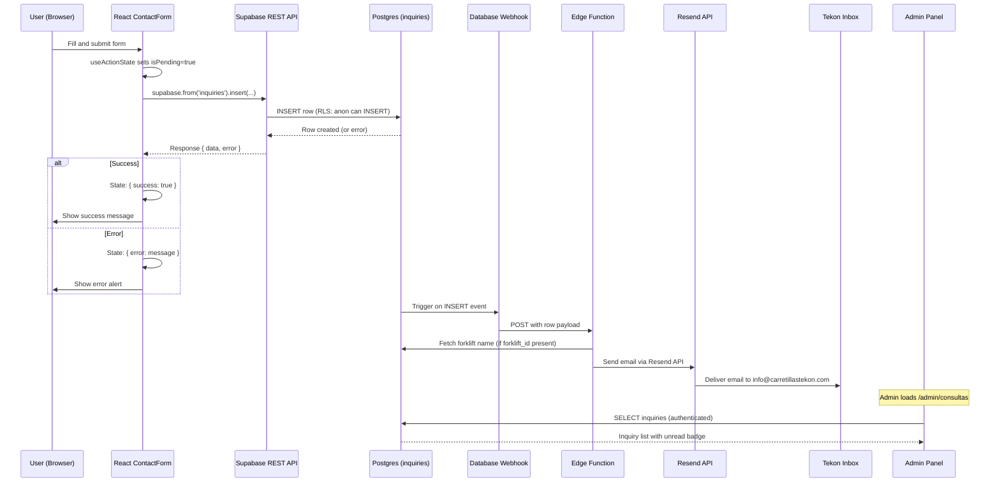
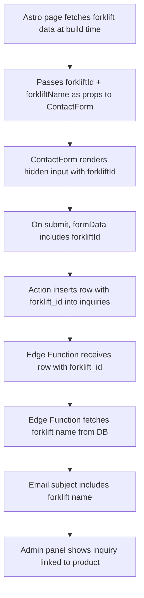

# Contact Form Flow -- Tekon Website

## Overview

- ContactForm is a React 19 island that submits inquiries to the Supabase `inquiries` table using the anon key
- Appears on two page types: standalone `/contacto` page and `/carretillas/[slug]` product detail pages
- Uses React 19 `useActionState` for form state management (pending, error, success)
- On insert, a Supabase Database Webhook triggers an Edge Function that sends email via Resend to the Tekon inbox
- Admin panel displays inquiries with unread badge; admin can mark as read or delete

## Key Concepts

- **React island**: ContactForm is a `.tsx` component hydrated client-side inside a static `.astro` page using `client:visible`
- **`useActionState`**: React 19 hook that manages form action state -- returns current state, a form action dispatcher, and a pending boolean
- **Supabase anon key insert**: The form submits directly from the browser using the public anon key; RLS allows `anon` to INSERT into `inquiries`
- **Database Webhook**: Supabase feature that fires an HTTP POST to an Edge Function when a row is inserted into `inquiries`
- **Forklift reference**: Optional `forklift_id` that links an inquiry to a specific product, pre-filled when the form appears on a product detail page

## Data Flow



---

## 1. Where the Form Appears

| Page | Route | Behavior |
|------|-------|----------|
| Contact page | `/contacto` | Standalone form with phone, address, and Google Map embed alongside it |
| Product detail | `/carretillas/[slug]` | Form at bottom of page, pre-filled with forklift reference (hidden `forklift_id` field) |

### Astro page integration

```astro
---
// src/pages/contacto.astro
import Layout from '../layouts/Layout.astro';
import ContactForm from '../components/ContactForm';
---

<Layout title="Contacto | Tekon">
  <section>
    <h1>Contacto</h1>
    <p>Telefono: ...</p>
    <p>Direccion: ...</p>
    <ContactForm client:visible />
  </section>
  <GoogleMap client:visible />
</Layout>
```

```astro
---
// src/pages/carretillas/[slug].astro
import Layout from '../../layouts/Layout.astro';
import ContactForm from '../../components/ContactForm';

const { slug } = Astro.params;
const { data: forklift } = await supabase
  .from('forklifts')
  .select('*')
  .eq('slug', slug)
  .eq('is_published', true)
  .single();
---

<Layout title={`${forklift.name} | Tekon`}>
  <!-- Static product content: image, description, specs table, PDF link -->
  <ContactForm
    client:visible
    forkliftId={forklift.id}
    forkliftName={forklift.name}
  />
</Layout>
```

- `client:visible` defers loading the form's JS bundle until the user scrolls to it
- The form is typically at the bottom of the page, so deferred hydration avoids unnecessary JS on initial load

---

## 2. Form Fields and Validation

### Field definitions

| Field | HTML Type | Required | Validation | Maps to column |
|-------|-----------|----------|------------|----------------|
| Nombre | `<Input>` text | Yes | Non-empty, trimmed | `name` |
| Email | `<Input>` email | Yes | Non-empty, valid email format | `email` |
| Mensaje | `<Textarea>` | Yes | Non-empty, trimmed | `message` |
| Producto | `<input type="hidden">` | No | Valid UUID or absent | `forklift_id` |

### TypeScript interfaces

```typescript
interface InquiryInsert {
  name: string;
  email: string;
  message: string;
  forklift_id?: string;  // UUID, only present on product detail pages
}

interface FormState {
  success: boolean;
  error: string | null;
}
```

### Validation rules

- **Client-side**: HTML5 `required` attribute on name, email, and message fields; `type="email"` on email field for browser-native format check
- **Server-side (RLS/Postgres)**: `name`, `email`, and `message` columns are `NOT NULL`; Postgres rejects inserts with missing values
- **No additional client-side validation library needed** -- HTML5 validation is sufficient for this simple form
- Trim whitespace from all text fields before submission

---

## 3. React 19 Action Pattern

### `useActionState` hook

```tsx
// src/components/ContactForm.tsx
import { useActionState } from 'react';

const [state, formAction, isPending] = useActionState(submitInquiry, {
  success: false,
  error: null,
});
```

| Return value | Type | Purpose |
|-------------|------|---------|
| `state` | `FormState` | Current form result: `{ success, error }` |
| `formAction` | `(formData: FormData) => void` | Passed to `<form action={formAction}>` |
| `isPending` | `boolean` | `true` while the action is executing |

### Action function

```typescript
// src/lib/actions.ts
import { supabase } from './supabase';

export async function submitInquiry(
  _prevState: FormState,
  formData: FormData
): Promise<FormState> {
  const name = (formData.get('name') as string)?.trim();
  const email = (formData.get('email') as string)?.trim();
  const message = (formData.get('message') as string)?.trim();
  const forkliftId = formData.get('forkliftId') as string | null;

  // Defensive check (HTML5 validation should prevent this)
  if (!name || !email || !message) {
    return { success: false, error: 'Todos los campos son obligatorios.' };
  }

  const insertData: InquiryInsert = { name, email, message };
  if (forkliftId) {
    insertData.forklift_id = forkliftId;
  }

  const { error } = await supabase.from('inquiries').insert(insertData);

  if (error) {
    return {
      success: false,
      error: 'Ha ocurrido un error al enviar tu consulta. Intentalo de nuevo.',
    };
  }

  return { success: true, error: null };
}
```

### Why `useActionState` over `useState` + `onSubmit`

- Built-in `isPending` eliminates manual loading state management
- Form actions integrate with React 19's transition system -- the UI stays responsive during submission
- Progressive enhancement: the form structure uses `<form action={...}>` which is the standard HTML pattern
- Reduces boilerplate compared to managing `isLoading`, `error`, and `success` as separate state variables

---

## 4. Full Component Implementation

```tsx
// src/components/ContactForm.tsx
import { useActionState, useRef, useEffect } from 'react';
import { submitInquiry } from '../lib/actions';
import { Button } from './ui/button';
import { Input } from './ui/input';
import { Textarea } from './ui/textarea';
import { Label } from './ui/label';
import { Alert, AlertDescription } from './ui/alert';

interface ContactFormProps {
  forkliftId?: string;
  forkliftName?: string;
}

export default function ContactForm({ forkliftId, forkliftName }: ContactFormProps) {
  const [state, formAction, isPending] = useActionState(submitInquiry, {
    success: false,
    error: null,
  });

  const formRef = useRef<HTMLFormElement>(null);

  // Reset form fields on successful submission
  useEffect(() => {
    if (state.success && formRef.current) {
      formRef.current.reset();
    }
  }, [state.success]);

  return (
    <section aria-labelledby="contact-form-heading">
      <h2 id="contact-form-heading">
        {forkliftName
          ? `Solicitar informacion sobre ${forkliftName}`
          : 'Enviar consulta'}
      </h2>

      {state.success && (
        <Alert>
          <AlertDescription>
            Tu consulta ha sido enviada correctamente. Te responderemos lo antes posible.
          </AlertDescription>
        </Alert>
      )}

      {state.error && (
        <Alert variant="destructive">
          <AlertDescription>{state.error}</AlertDescription>
        </Alert>
      )}

      <form ref={formRef} action={formAction} className="space-y-4">
        {forkliftId && (
          <input type="hidden" name="forkliftId" value={forkliftId} />
        )}

        <div className="space-y-2">
          <Label htmlFor="contact-name">Nombre</Label>
          <Input
            id="contact-name"
            name="name"
            required
            autoComplete="name"
            disabled={isPending}
          />
        </div>

        <div className="space-y-2">
          <Label htmlFor="contact-email">Email</Label>
          <Input
            id="contact-email"
            name="email"
            type="email"
            required
            autoComplete="email"
            disabled={isPending}
          />
        </div>

        <div className="space-y-2">
          <Label htmlFor="contact-message">Mensaje</Label>
          <Textarea
            id="contact-message"
            name="message"
            required
            rows={5}
            disabled={isPending}
          />
        </div>

        <Button type="submit" disabled={isPending}>
          {isPending ? 'Enviando...' : 'Enviar consulta'}
        </Button>
      </form>
    </section>
  );
}
```

### shadcn/ui components used

| Component | Import | Purpose |
|-----------|--------|---------|
| `Button` | `./ui/button` | Submit button with disabled state during pending |
| `Input` | `./ui/input` | Name and email fields |
| `Textarea` | `./ui/textarea` | Message field |
| `Label` | `./ui/label` | Accessible labels linked to inputs via `htmlFor` |
| `Alert` + `AlertDescription` | `./ui/alert` | Success and error feedback messages |

---

## 5. Supabase Insert

### Client configuration

- The form uses the public Supabase client from `src/lib/supabase.ts`
- This client uses the anon key exposed via `PUBLIC_SUPABASE_ANON_KEY`
- RLS policy `inquiries_insert_anon` allows `anon` role to INSERT into `inquiries`

### Insert operation

```typescript
const { error } = await supabase.from('inquiries').insert({
  name: 'Juan Garcia',
  email: 'juan@example.com',
  message: 'Estoy interesado en el modelo S100...',
  forklift_id: 'uuid-of-forklift',  // optional
});
```

### What happens at the database level

1. Supabase REST API receives the POST request with the anon key
2. Postgres checks RLS policy: `anon` can INSERT into `inquiries` (WITH CHECK returns true)
3. Row is created with auto-generated `id` (UUID), `read` defaults to `false`, `created_at` defaults to `now()`
4. If `forklift_id` is provided, the foreign key constraint validates it exists in `forklifts`; if the referenced forklift is later deleted, `ON DELETE SET NULL` nullifies the reference

### inquiries table schema

```sql
CREATE TABLE inquiries (
  id uuid PRIMARY KEY DEFAULT gen_random_uuid(),
  name text NOT NULL,
  email text NOT NULL,
  message text NOT NULL,
  forklift_id uuid REFERENCES forklifts (id) ON DELETE SET NULL,
  read boolean NOT NULL DEFAULT false,
  created_at timestamptz NOT NULL DEFAULT now()
);

CREATE INDEX idx_inquiries_read ON inquiries (read) WHERE read = false;
CREATE INDEX idx_inquiries_created ON inquiries (created_at DESC);
```

---

## 6. Error Handling

### Error sources and handling

| Error source | Cause | User-facing message |
|-------------|-------|-------------------|
| Network failure | No internet, Supabase down | "Ha ocurrido un error al enviar tu consulta. Intentalo de nuevo." |
| RLS rejection | Should not happen (anon INSERT is allowed) | Same generic error message |
| Invalid forklift_id | UUID does not exist in `forklifts` table | Same generic error message (foreign key violation) |
| Missing required field | HTML5 validation should prevent; Postgres NOT NULL catches remainder | "Todos los campos son obligatorios." |

### Error handling strategy

- **No detailed error messages to the user** -- Supabase error details could leak schema information
- **Generic error message** for all Supabase errors: "Ha ocurrido un error al enviar tu consulta. Intentalo de nuevo."
- **Console logging** in development only for debugging
- The error alert uses shadcn/ui `Alert` with `variant="destructive"` (red styling)

### Error state reset

- Error clears when the user submits the form again (the action returns a new state)
- Success message persists until the next submission attempt

---

## 7. Success State

### Behavior on successful submission

1. `state.success` becomes `true`
2. Success `Alert` renders with confirmation message: "Tu consulta ha sido enviada correctamente. Te responderemos lo antes posible."
3. Form fields are reset via `formRef.current.reset()` in a `useEffect`
4. The form remains visible so the user can submit another inquiry if needed

### Why not redirect or hide the form

- The form is embedded in a product page or contact page -- navigating away would lose context
- Hiding the form prevents additional inquiries
- The success message provides clear feedback without disrupting the page

---

## 8. Forklift Reference Handling

### How the forklift reference flows through the system



### On `/contacto` (no forklift reference)

- `forkliftId` prop is not passed
- No hidden input rendered
- `forklift_id` column is NULL in the inserted row
- Email subject: "Nueva consulta de {name}"
- Admin panel shows inquiry without product link

### On `/carretillas/[slug]` (with forklift reference)

- `forkliftId` and `forkliftName` props passed from Astro page
- Hidden input: `<input type="hidden" name="forkliftId" value={forkliftId} />`
- `forklift_id` column is set to the forklift's UUID
- Email subject: "Nueva consulta sobre {forkliftName} - {name}"
- Admin panel shows inquiry with link to the product
- Form heading adapts: "Solicitar informacion sobre {forkliftName}"

---

## 9. Email Notification Chain

### Trigger mechanism

1. Row inserted into `inquiries` table
2. Supabase Database Webhook `on_inquiry_created` fires on INSERT events
3. Webhook sends HTTP POST to the `send-inquiry-email` Edge Function
4. Edge Function processes the payload and sends email via Resend

### Webhook configuration

| Setting | Value |
|---------|-------|
| Name | `on_inquiry_created` |
| Table | `inquiries` |
| Events | `INSERT` |
| Type | Supabase Edge Function |
| Edge Function | `send-inquiry-email` |

### Webhook payload

```json
{
  "type": "INSERT",
  "table": "inquiries",
  "record": {
    "id": "uuid-here",
    "name": "Juan Garcia",
    "email": "juan@example.com",
    "message": "Estoy interesado en el modelo S100...",
    "forklift_id": "uuid-or-null",
    "read": false,
    "created_at": "2026-03-04T10:00:00Z"
  },
  "schema": "public",
  "old_record": null
}
```

### Edge Function logic

```typescript
// supabase/functions/send-inquiry-email/index.ts
// 1. Parse webhook payload to extract inquiry record
// 2. If forklift_id is present, fetch forklift name from DB (using service role key)
// 3. Build email subject and HTML body
// 4. Send via Resend API
```

### Email details

| Property | Value |
|----------|-------|
| From | `Tekon Web <noreply@carretillastekon.com>` |
| To | `info@carretillastekon.com` |
| Subject (with product) | `Nueva consulta sobre {forkliftName} - {name}` |
| Subject (without product) | `Nueva consulta de {name}` |
| Body | HTML with name, email, product (if applicable), message, timestamp |

### Email HTML body structure

```html
<h2>Nueva consulta recibida</h2>
<p><strong>Nombre:</strong> {name}</p>
<p><strong>Email:</strong> {email}</p>
<!-- Only if forklift_id present -->
<p><strong>Producto:</strong> {forkliftName}</p>
<p><strong>Mensaje:</strong></p>
<p>{message}</p>
<hr />
<p style="color: #888; font-size: 12px;">
  Recibido el {formatted date in es-ES locale}
</p>
```

### Resend limits

- Free tier: 3,000 emails/month
- Expected usage: well under 50 inquiries/month for a regional forklift dealer
- Domain `carretillastekon.com` must be verified in Resend dashboard via DNS records

---

## 10. Admin Panel Integration

### Inquiries view in admin

- Admin navigates to `/admin/consultas` inside the React SPA
- `InquiriesTable` component fetches all inquiries ordered by `created_at DESC`
- Unread inquiries (`read = false`) show a visual indicator (badge or bold text)
- Admin sidebar shows unread count badge

### Admin operations on inquiries

| Operation | Supabase call | RLS |
|-----------|--------------|-----|
| List all | `supabase.from('inquiries').select('*, forklifts(name)').order('created_at', { ascending: false })` | `authenticated` can SELECT |
| Mark as read | `supabase.from('inquiries').update({ read: true }).eq('id', inquiryId)` | `authenticated` can UPDATE |
| Delete | `supabase.from('inquiries').delete().eq('id', inquiryId)` | `authenticated` can DELETE |

### Unread count for badge

```typescript
const { count } = await supabase
  .from('inquiries')
  .select('*', { count: 'exact', head: true })
  .eq('read', false);
```

---

## 11. Spam Prevention Considerations

### Current approach

- No CAPTCHA or honeypot implemented in the initial version
- RLS restricts the anon role to INSERT only -- no reads, updates, or deletes on inquiries
- Rate limiting relies on Supabase's built-in rate limits (default: varies by plan)

### Future mitigation options (if spam becomes a problem)

| Technique | Complexity | Effectiveness |
|-----------|-----------|---------------|
| Honeypot field (hidden input that bots fill) | Low | Moderate -- catches basic bots |
| Time-based check (reject submissions under 2 seconds) | Low | Moderate -- catches automated submissions |
| Turnstile/hCaptcha (Cloudflare Turnstile or similar) | Medium | High -- invisible CAPTCHA, good UX |
| Server-side rate limiting via Edge Function | Medium | High -- limit per IP per time window |
| Supabase RLS rate policy (pg_rate_limiter extension) | Medium | High -- database-level rate limiting |

### Recommended first step if spam occurs

- Add a honeypot field: a hidden `<input>` that legitimate users never fill, but bots do
- Check in the action function: if the honeypot field has a value, silently return success (do not alert the bot)

```tsx
// Honeypot pattern
<input
  type="text"
  name="website"
  style={{ position: 'absolute', left: '-9999px' }}
  tabIndex={-1}
  autoComplete="off"
  aria-hidden="true"
/>
```

```typescript
// In submitInquiry action
const honeypot = formData.get('website') as string;
if (honeypot) {
  // Bot detected -- return fake success
  return { success: true, error: null };
}
```

---

## 12. Accessibility

### Form accessibility features

- All inputs have associated `<Label>` components linked via `htmlFor`/`id` pairs
- Form section uses `aria-labelledby` pointing to the heading
- Success and error alerts use shadcn/ui `Alert` which renders with `role="alert"` for screen readers
- Submit button shows "Enviando..." text during pending state (screen readers announce the change)
- Inputs have `autoComplete` attributes for browser autofill support
- Disabled state on inputs during submission prevents double-submit and signals non-interactivity

### Keyboard navigation

- Tab order follows natural DOM order: name, email, message, submit
- Enter key on the submit button triggers form submission
- Focus management: no custom focus traps needed (the form is inline, not a modal)

### Color considerations

- Error alerts use `variant="destructive"` (red) -- ensure contrast ratio meets WCAG AA
- Success alerts should use a distinguishable color (green) with sufficient contrast
- Do not rely on color alone to convey status; the text message communicates the state

---

## 13. Edge Cases

| Scenario | Behavior |
|----------|----------|
| **User submits with JS disabled** | Form will not work; ContactForm is a React island that requires JS. The `client:visible` directive means no form HTML is rendered until JS loads. No graceful degradation. |
| **Forklift deleted after page was built** | `forklift_id` in the form still references the old UUID. Supabase foreign key has `ON DELETE SET NULL`, so the insert succeeds with `forklift_id = NULL`. The inquiry is not lost. |
| **User submits the same form twice** | Both submissions create separate rows. No deduplication is enforced. The `isPending` state disables the button during submission, reducing accidental double-clicks. |
| **Very long message** | Postgres `text` type has no length limit. Consider adding a `maxLength` attribute to `<Textarea>` (e.g., 2000 characters) for UX, but the database will accept any length. |
| **Email delivery fails** | The Edge Function returns a 500 but the inquiry row is already in the database. The admin can still see it in the panel. Email failure does not affect the user's success message. |
| **Webhook fails** | If the webhook or Edge Function is down, the inquiry row is saved but no email is sent. The admin must check the panel directly. Supabase does not retry failed webhooks by default. |
| **Invalid email format** | HTML5 `type="email"` validation catches most invalid formats client-side. Postgres does not validate email format; it accepts any text. |
| **Network timeout during submission** | The Supabase client will throw an error, caught by the action function, and the generic error message is shown. The user can retry. |

---

## Constraints

- The form requires JavaScript -- no progressive enhancement for non-JS browsers
- Email notifications are fire-and-forget; there is no retry mechanism for failed webhook/email delivery
- No CAPTCHA in initial implementation; spam prevention is deferred until it becomes a problem
- The Supabase anon key is public; the form endpoint cannot be hidden from automated requests
- `forklift_id` validation is limited to foreign key constraint; there is no check that the forklift is still published
- The form does not support file attachments
- All form UI text is in Spanish (hardcoded); no internationalization

## Related Documentation

- `supabase-setup-schema.md` -- inquiries table DDL, RLS policies, Database Webhook setup, Edge Function code, Resend configuration
- `astro-react-islands.md` -- React 19 features, `useActionState` pattern, island hydration directives, shadcn/ui integration
- `supabase-auth-admin.md` -- admin panel auth, RLS for authenticated role on inquiries table
