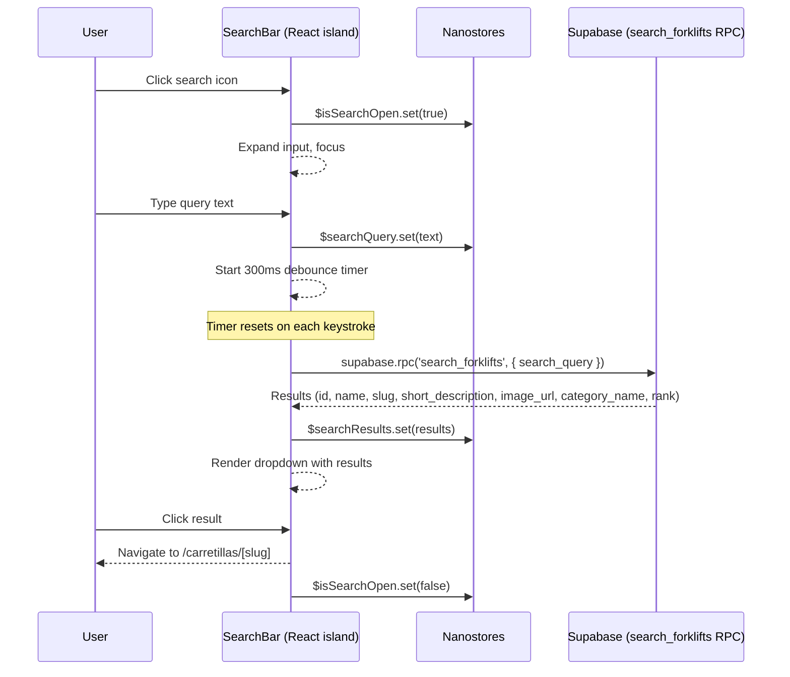

# Global Search System

## Overview

- Search bar in the site header provides full-text search across all published forklifts
- Search icon expands into an input field on click; debounced at 300ms before querying Supabase
- Queries the `search_forklifts` RPC function which searches across forklift name, descriptions, and category name using Spanish text search config
- Dropdown displays up to 8 results with thumbnail, name, and category badge; clicking navigates to `/carretillas/[slug]`
- React island with `client:load` directive -- must be interactive immediately on every page
- Cross-island state shared via nanostores (`$searchQuery`, `$searchResults`, `$isSearchOpen`)

## Key Concepts

- **Full-text search (FTS)**: Postgres `tsvector` column with Spanish stemming; "elevadoras" matches "elevadora"
- **Weighted search**: Name has weight A (highest priority), `short_description` has weight B, `description` has weight C
- **RPC function**: `search_forklifts` extends the base FTS by also matching against category name via a JOIN
- **Debouncing**: 300ms delay between the last keystroke and the Supabase query to avoid excessive API calls
- **Nanostores**: Lightweight (~1KB) state manager that works across independent React island roots; replaces React context for cross-island state

## Data Flow



## UI Behavior

### Search Icon and Input Expansion

- Default state: a search icon button visible in the header
- On click: the icon expands into a text input field with focus
- The input shows placeholder text (e.g., "Buscar carretillas...")
- On mobile: the input may expand to full header width or open as an overlay

### Search Lifecycle

| Step | Action | Result |
|------|--------|--------|
| 1 | User clicks search icon | Input expands, receives focus |
| 2 | User types query | `$searchQuery` updates, debounce timer starts |
| 3 | 300ms elapses without new keystrokes | Supabase RPC call fires |
| 4 | Results arrive | Dropdown renders below input |
| 5 | User clicks a result | Navigation to `/carretillas/[slug]` |
| 6 | User presses Escape or clicks outside | Search closes, input collapses |

### Closing the Search

- **Escape key**: closes dropdown and collapses input
- **Click outside**: closes dropdown and collapses input (use a click-outside listener or overlay backdrop)
- **Result click**: navigates away, which inherently closes the search
- On close: `$isSearchOpen` is set to `false`, `$searchQuery` is cleared, `$searchResults` is emptied

## Debouncing

- Debounce delay: **300ms**
- Every keystroke resets the timer
- Only the final query (after 300ms of inactivity) triggers a Supabase call
- While the debounce timer is active, no loading indicator is needed
- After the timer fires (query is in flight), show a loading state in the dropdown

### Implementation Pattern

```typescript
import { useEffect, useRef } from 'react';

function useDebounce(callback: (value: string) => void, delay: number) {
  const timerRef = useRef<ReturnType<typeof setTimeout>>();

  return (value: string) => {
    clearTimeout(timerRef.current);
    timerRef.current = setTimeout(() => callback(value), delay);
  };
}

// Usage inside SearchBar
const debouncedSearch = useDebounce(async (query: string) => {
  if (query.trim().length === 0) {
    $searchResults.set([]);
    return;
  }

  const { data } = await supabase.rpc('search_forklifts', {
    search_query: query,
  });

  $searchResults.set(data ?? []);
}, 300);
```

## Supabase Query

### RPC Function: `search_forklifts`

- Defined in SQL (see `supabase-setup-schema.md` for full definition)
- Combines the forklift `fts` tsvector with the category name for broader matching
- Uses `plainto_tsquery('spanish', search_query)` for natural language input parsing
- Returns up to 8 results ordered by `ts_rank` (relevance)
- Only returns published forklifts (`is_published = true`)

### Client-Side Call

```typescript
const { data, error } = await supabase.rpc('search_forklifts', {
  search_query: userInput,
});
```

### Return Type

```typescript
interface SearchResult {
  id: string;
  name: string;
  slug: string;
  short_description: string;
  image_url: string | null;
  category_name: string;
  rank: number;
}
```

### Query Behavior

| Input | Behavior |
|-------|----------|
| `"carretilla electrica"` | Spanish stemming matches "carretillas electricas", "carretilla electrica", etc. |
| `"retractil"` | Matches forklifts with "retractil" in name/description AND forklifts in the "Retractiles" category |
| `""` (empty) | Should not be sent -- guard in client code |
| `"xyzabc"` (no matches) | Returns empty array |

## Result Rendering

### Dropdown Structure

- Positioned directly below the search input (absolute/fixed positioning)
- Maximum 8 results displayed
- Each result row contains:
  - **Thumbnail**: forklift image (small, e.g., 48x48 or 64x64), with fallback placeholder if `image_url` is null
  - **Name**: forklift name as primary text
  - **Category badge**: category name displayed as a `Badge` component
- Results are ordered by relevance (`rank` from the RPC function)

### Result Item Layout

```tsx
function SearchResultItem({ result }: { result: SearchResult }) {
  return (
    <a
      href={`/carretillas/${result.slug}`}
      className="flex items-center gap-3 px-4 py-2 hover:bg-accent"
    >
      
      <div className="flex-1 min-w-0">
        <p className="font-medium truncate">{result.name}</p>
        <p className="text-sm text-muted-foreground truncate">
          {result.short_description}
        </p>
      </div>
      <Badge variant="secondary">{result.category_name}</Badge>
    </a>
  );
}
```

### Empty State

- When the query returns zero results, display: **"No se encontraron resultados"**
- Shown inside the dropdown area so the user sees feedback
- No "try again" or suggestion logic needed at this stage

### Loading State

- While the RPC call is in flight, show a loading indicator (e.g., spinner or `Skeleton` components)
- Replace the loading indicator with results (or empty state) once the response arrives

## Keyboard and Mouse Interactions

| Interaction | Behavior |
|-------------|----------|
| Click search icon | Open search, expand input, focus |
| Type in input | Update query, trigger debounced search |
| Arrow Down / Arrow Up | Navigate through result items (optional enhancement) |
| Enter (with item focused) | Navigate to that result's page |
| Escape | Close search, collapse input |
| Click outside search area | Close search, collapse input |
| Click on result item | Navigate to `/carretillas/[slug]` |
| Tab | Move focus through results (accessibility) |

### Keyboard Navigation Implementation Notes

- Use `aria-activedescendant` pattern or manage focus with `ref` array on result items
- Arrow key navigation is an enhancement; basic implementation only requires click and Escape

## Nanostores Integration

### Store Definitions

```typescript
// src/stores/searchStore.ts
import { atom } from 'nanostores';

export const $searchQuery = atom<string>('');
export const $searchResults = atom<SearchResult[]>([]);
export const $isSearchOpen = atom<boolean>(false);
```

### Usage in SearchBar

```typescript
import { useStore } from '@nanostores/react';
import { $searchQuery, $searchResults, $isSearchOpen } from '../stores/searchStore';

function SearchBar() {
  const query = useStore($searchQuery);
  const results = useStore($searchResults);
  const isOpen = useStore($isSearchOpen);

  // Component reads from stores and writes back via .set()
}
```

### Why Nanostores

- SearchBar is a React island with its own React root -- it cannot share context with other islands
- Other islands (e.g., ProductGrid) could potentially read `$searchQuery` to highlight matches or adjust display
- Nanostores work outside the React tree, so any island or even vanilla JS can subscribe
- See `astro-react-islands.md` for the full nanostores architecture

### Store Lifecycle

| Event | Store Updates |
|-------|-------------|
| Search opens | `$isSearchOpen` = `true` |
| User types | `$searchQuery` = current input value |
| Results arrive | `$searchResults` = result array |
| Search closes | `$isSearchOpen` = `false`, `$searchQuery` = `''`, `$searchResults` = `[]` |
| Page navigation (result click) | Stores reset implicitly (full page navigation in Astro reloads islands) |

## Component Structure

### File Location

```
src/
  components/
    SearchBar.tsx           -- Main search island component
  stores/
    searchStore.ts          -- Nanostores for search state
  lib/
    supabase.ts             -- Supabase client singleton
```

### SearchBar Component Breakdown

```
SearchBar.tsx
  |-- SearchTrigger         -- Icon button that opens the search
  |-- SearchInput           -- Text input with debounced onChange
  |-- SearchDropdown        -- Positioned container for results
      |-- SearchResultItem  -- Individual result row (thumbnail, name, badge)
      |-- SearchEmptyState  -- "No se encontraron resultados" message
      |-- SearchLoading     -- Loading skeleton/spinner
```

- These can be separate components within `SearchBar.tsx` or extracted to separate files under `src/components/search/`
- All sub-components live within the same React island -- they share React context and state normally

### Astro Integration

```astro
---
// src/layouts/Layout.astro (or Header.astro)
import SearchBar from '../components/SearchBar';
---

<header>
  <nav><!-- static navigation links --></nav>
  <SearchBar client:load />
</header>
```

- `client:load` ensures the search is interactive immediately on page load
- The SearchBar island is present on every page via the shared layout

## Accessibility

- **Search input**: `role="search"` on the containing element, or use a `<form role="search">`
- **Input label**: `aria-label="Buscar carretillas"` on the input (no visible label needed since the icon provides context)
- **Dropdown**: `role="listbox"` on the results container
- **Result items**: `role="option"` on each result, with `aria-selected` for keyboard-highlighted item
- **Focus management**: focus moves to input when search opens; focus returns to the search icon when search closes
- **Escape key**: closes the search and returns focus to the trigger
- **Screen reader announcements**: use `aria-live="polite"` region to announce result count (e.g., "8 resultados encontrados")

## shadcn/ui Components

| Component | Usage in Search |
|-----------|----------------|
| `Input` | Search text input field |
| `Badge` | Category name badge on each result item |
| `Skeleton` | Loading state placeholders while results load |
| `Button` | Search icon trigger button |

## Edge Cases

| Scenario | Handling |
|----------|----------|
| Empty query (whitespace only) | Do not send RPC call; clear results |
| Query shorter than 2 characters | Optionally skip search to avoid overly broad results; or let Postgres handle it |
| Very fast typing | Debounce ensures only the final query fires |
| Network error on RPC call | Show a brief error message in the dropdown; do not crash the component |
| `image_url` is null | Display a placeholder image |
| Forklift with very long name | Truncate with CSS (`truncate` / `text-overflow: ellipsis`) |
| User navigates via browser back after clicking a result | Astro performs full page navigation, so search state resets naturally |
| Multiple rapid open/close toggles | Guard against race conditions; the latest `$isSearchOpen` value wins |
| Search while on a product detail page | Works normally; header search is global and independent of page content |
| Stale results from a previous query | Each new debounced call replaces `$searchResults`; consider an abort controller to cancel in-flight requests when a new query starts |

### AbortController Pattern (Race Condition Prevention)

```typescript
const abortRef = useRef<AbortController>();

const debouncedSearch = useDebounce(async (query: string) => {
  // Cancel any in-flight request
  abortRef.current?.abort();
  abortRef.current = new AbortController();

  if (query.trim().length === 0) {
    $searchResults.set([]);
    return;
  }

  try {
    const { data } = await supabase.rpc('search_forklifts', {
      search_query: query,
    }, { signal: abortRef.current.signal });

    $searchResults.set(data ?? []);
  } catch (err) {
    if (err.name !== 'AbortError') {
      // Handle real errors
      console.error('Search failed:', err);
    }
  }
}, 300);
```

## Constraints

- The `search_forklifts` RPC function is limited to 8 results -- no pagination in the search dropdown
- Search only covers published forklifts (`is_published = true` is enforced server-side in the RPC)
- The anon key is used for search queries, so RLS policies apply
- Spanish text search config is hardcoded in the RPC function; does not support other languages
- The `fts` column is a generated column -- it updates automatically when `name`, `short_description`, or `description` change, but category name changes do not update the `fts` column (the RPC function handles category matching dynamically via JOIN)
- Search input does not support advanced query syntax (no quotes, no boolean operators); `plainto_tsquery` treats all input as plain text
- The SearchBar React island adds to the JS bundle on every page (~8-12KB including the search island and its dependencies)

## Related Documentation

- `astro-react-islands.md` -- Islands architecture, hydration directives, nanostores pattern
- `supabase-setup-schema.md` -- FTS column definition, `search_forklifts` RPC function, GIN index, Supabase client setup
- `product-filters-system.md` -- The filtering system on listing pages (separate from search but shares nanostores pattern)
