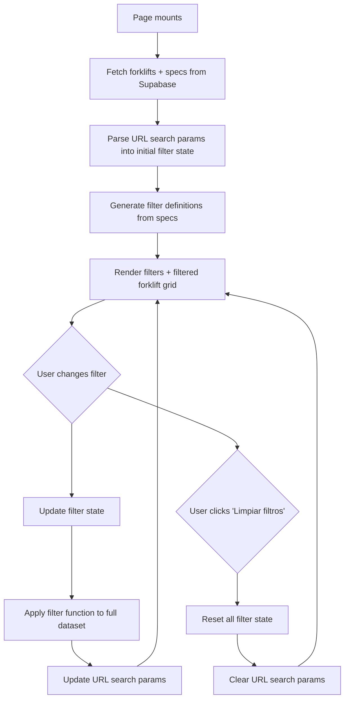
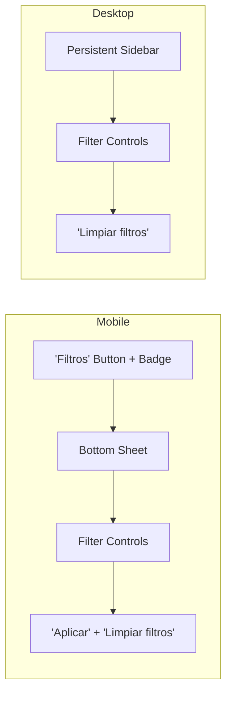

# Product Filters System

## Overview

- Client-side filtering system for the three forklift listing pages (sale, rental, used)
- Filters are dynamically generated from `forklift_specs` table distinct `spec_name` values
- Numeric specs render as range sliders; text specs render as checkbox groups
- Filter state syncs bidirectionally with URL search params for shareable URLs
- Single reusable React island component parameterized by availability type
- Dataset is small (~20-30 items) so all filtering happens client-side after initial load

## Key Concepts

- **React island**: An interactive React component hydrated within a static Astro page
- **Availability type**: One of `available_for_sale`, `available_for_rental`, `available_as_used` -- determines which forklifts appear on each listing page
- **Spec-based filtering**: Filters derive from the EAV (Entity-Attribute-Value) pattern in `forklift_specs`, not from fixed columns
- **Numeric vs text detection**: A spec is numeric if all its `spec_value` entries across the dataset parse as numbers; otherwise it is text

## Pages Using This System

| Route | Availability flag | Page title |
|-------|-------------------|------------|
| `/venta-de-carretillas` | `available_for_sale` | Venta de carretillas |
| `/alquiler-de-carretillas` | `available_for_rental` | Alquiler de carretillas |
| `/carretillas-de-segunda-mano` | `available_as_used` | Carretillas de segunda mano |

- All three pages use the exact same React island component
- The only difference is the `availabilityField` prop passed to the component

## Data Flow



## Data Loading

### Supabase Query

- Fetch all published forklifts where the relevant availability flag is `true`
- Include all related specs via a join on `forklift_specs`

```typescript
const { data } = await supabase
  .from('forklifts')
  .select(`
    *,
    forklift_specs (*),
    categories (name, slug)
  `)
  .eq('is_published', true)
  .eq(availabilityField, true)  // e.g., 'available_for_sale'
  .order('name');
```

### Data Shape After Fetch

- Each forklift object contains a `forklift_specs` array
- Each spec has: `spec_name`, `spec_value`, `spec_unit`, `sort_order`

```typescript
interface Forklift {
  id: string;
  name: string;
  slug: string;
  image_url: string;
  short_description: string;
  category: { name: string; slug: string };
  forklift_specs: ForkliftSpec[];
}

interface ForkliftSpec {
  id: string;
  spec_name: string;   // e.g., "Capacidad nominal"
  spec_value: string;   // e.g., "1000"
  spec_unit: string;    // e.g., "kg"
  sort_order: number;
}
```

## Dynamic Filter Generation

- On data load, extract all distinct `spec_name` values across the entire dataset
- For each distinct `spec_name`, collect all its `spec_value` entries
- Determine filter type:

| Condition | Filter type | Component |
|-----------|-------------|-----------|
| Every `spec_value` for this `spec_name` parses as a finite number (`!isNaN(parseFloat(v)) && isFinite(v)`) | Numeric (range slider) | `Slider` |
| Any `spec_value` is non-numeric | Text (checkbox group) | `Checkbox` group |

### Filter Definition Structure

```typescript
interface NumericFilterDef {
  type: 'numeric';
  specName: string;       // e.g., "Capacidad nominal"
  unit: string;           // e.g., "kg" (from first spec entry)
  min: number;            // Minimum value across dataset
  max: number;            // Maximum value across dataset
  urlParamMin: string;    // e.g., "capacidad_nominal_min"
  urlParamMax: string;    // e.g., "capacidad_nominal_max"
}

interface TextFilterDef {
  type: 'text';
  specName: string;       // e.g., "Tipo de operador"
  options: string[];      // Distinct values, e.g., ["Sentado", "De pie"]
  urlParam: string;       // e.g., "tipo_de_operador"
}

type FilterDef = NumericFilterDef | TextFilterDef;
```

### URL Param Key Derivation

- Convert `spec_name` to lowercase
- Replace spaces with underscores
- Remove accents/diacritics (`normalize('NFD').replace(...)`)
- For numeric filters, append `_min` and `_max` suffixes
- Example: "Capacidad nominal" becomes `capacidad_nominal_min` / `capacidad_nominal_max`
- Example: "Tipo de alimentacion" becomes `tipo_de_alimentacion`

## Numeric Filters (Range Sliders)

- Display the spec name as label, with unit in parentheses: "Capacidad nominal (kg)"
- Slider range is `[min, max]` derived from all values of that spec across the dataset
- Dual-thumb slider for selecting a range (min and max)
- Display current selected values next to the slider
- If min equals max across the dataset, do not render a slider (nothing to filter)

### shadcn/ui Component

- Use `Slider` from shadcn/ui with `minStepsBetweenThumbs={1}`
- Pass `value={[currentMin, currentMax]}` as controlled component
- `onValueChange` updates filter state and URL params

## Text Filters (Checkbox Groups)

- Display the spec name as label: "Tipo de alimentacion"
- List all distinct `spec_value` entries as checkboxes
- Multiple selections allowed (OR logic within the same spec)
- Show the count of forklifts matching each option (optional enhancement)

### shadcn/ui Component

- Use `Checkbox` from shadcn/ui for each option
- Group under a collapsible section using the spec name as heading

## Client-Side Filtering Logic

### Filter Function

- Takes the full forklift array and the current active filters
- Returns the subset of forklifts that match ALL active filters (AND across different specs)
- Within a single text filter, matches if the forklift's spec value is in ANY of the selected options (OR within same spec)

```typescript
function filterForklifts(
  forklifts: Forklift[],
  activeFilters: ActiveFilters
): Forklift[] {
  return forklifts.filter(forklift => {
    return Object.entries(activeFilters).every(([specName, filterValue]) => {
      const spec = forklift.forklift_specs.find(s => s.spec_name === specName);

      // If forklift lacks this spec, exclude it when filter is active
      if (!spec) return false;

      if (filterValue.type === 'numeric') {
        const numVal = parseFloat(spec.spec_value);
        return numVal >= filterValue.min && numVal <= filterValue.max;
      }

      if (filterValue.type === 'text') {
        // OR logic: match if spec_value is any of the selected values
        return filterValue.selectedValues.includes(spec.spec_value);
      }

      return true;
    });
  });
}
```

### Logic Summary

| Across specs | Within a text spec | Within a numeric spec |
|-------------|-------------------|----------------------|
| AND | OR | Range (min <= value <= max) |

## Filter State Management

### State Structure

```typescript
interface ActiveFilters {
  [specName: string]: NumericFilterState | TextFilterState;
}

interface NumericFilterState {
  type: 'numeric';
  min: number;
  max: number;
}

interface TextFilterState {
  type: 'text';
  selectedValues: string[];
}
```

### State Initialization

1. Generate filter definitions from loaded data
2. Read URL search params
3. For each filter definition, check if corresponding URL params exist
4. If yes, initialize that filter's state from URL values
5. If no, that filter starts inactive (not included in `activeFilters`)

### Update Handlers

- **Numeric slider change**: Update `min`/`max` in state; if range equals full dataset range, remove from active filters
- **Checkbox toggle**: Add/remove value from `selectedValues`; if array becomes empty, remove from active filters
- **Reset all**: Set `activeFilters` to empty object `{}`

## URL Parameter Sync

### Writing to URL

- On every filter state change, serialize active filters to URL search params
- Use `window.history.replaceState` (not `pushState`) to avoid polluting browser history
- Only include params for active filters (omit filters at their default/full range)

```typescript
function syncFiltersToURL(activeFilters: ActiveFilters, filterDefs: FilterDef[]) {
  const params = new URLSearchParams();

  for (const def of filterDefs) {
    const filter = activeFilters[def.specName];
    if (!filter) continue;

    if (def.type === 'numeric' && filter.type === 'numeric') {
      if (filter.min !== def.min) params.set(def.urlParamMin, String(filter.min));
      if (filter.max !== def.max) params.set(def.urlParamMax, String(filter.max));
    }

    if (def.type === 'text' && filter.type === 'text') {
      // Comma-separated for multiple values
      params.set(def.urlParam, filter.selectedValues.join(','));
    }
  }

  const qs = params.toString();
  const newUrl = qs ? `${window.location.pathname}?${qs}` : window.location.pathname;
  window.history.replaceState({}, '', newUrl);
}
```

### Reading from URL

- On component mount, parse `window.location.search`
- Match URL param keys to filter definitions
- Parse numeric values with `parseInt`/`parseFloat`
- Split comma-separated text values

### URL Format Examples

| User action | Resulting URL |
|-------------|---------------|
| Set capacity range 1000-3000 | `?capacidad_nominal_min=1000&capacidad_nominal_max=3000` |
| Select electric power type | `?tipo_de_alimentacion=electrico` |
| Select multiple power types | `?tipo_de_alimentacion=electrico,diesel` |
| Combined filters | `?capacidad_nominal_min=1000&tipo_de_alimentacion=electrico` |
| No active filters | `/venta-de-carretillas` (clean URL) |

## Responsive Layout

### Desktop (> 1024px)

- Persistent filter sidebar on the left (fixed width ~280px)
- Three-column forklift card grid to the right
- Sidebar scrolls independently if filters exceed viewport height
- "Limpiar filtros" button at top of sidebar

### Tablet (768-1024px)

- Collapsible sidebar (can be toggled open/closed)
- Two-column forklift card grid
- Sidebar overlays or pushes content depending on implementation

### Mobile (< 768px)

- No sidebar visible by default
- Fixed "Filtros" button at bottom of screen (or top of grid)
- Button shows active filter count as a `Badge`: "Filtros (3)"
- Tapping opens a bottom `Sheet` (shadcn/ui) containing all filter controls
- Sheet has "Aplicar" (apply/close) and "Limpiar filtros" (reset) buttons
- Stacked single-column card grid



## shadcn/ui Components

| Component | Usage | Import |
|-----------|-------|--------|
| `Slider` | Dual-thumb range sliders for numeric specs | `@/components/ui/slider` |
| `Checkbox` | Individual checkboxes for text spec values | `@/components/ui/checkbox` |
| `Sheet` | Mobile bottom sheet containing all filters | `@/components/ui/sheet` |
| `Button` | "Filtros" trigger button, "Limpiar filtros" reset | `@/components/ui/button` |
| `Badge` | Active filter count on mobile button | `@/components/ui/badge` |
| `Label` | Spec name labels for each filter group | `@/components/ui/label` |
| `Separator` | Visual dividers between filter groups | `@/components/ui/separator` |
| `ScrollArea` | Scrollable filter sidebar when content overflows | `@/components/ui/scroll-area` |

## "Limpiar filtros" Reset

- Clears the `activeFilters` state to `{}`
- Resets all sliders to their full `[min, max]` range
- Unchecks all checkboxes
- Removes all filter-related URL search params (clean URL)
- Visible on desktop sidebar and inside mobile bottom sheet
- Only shown when at least one filter is active

## Component Reusability

### Single Component, Three Pages

```typescript
// Each Astro page renders the same React island with a different prop
<ForkliftListingIsland
  client:load
  availabilityField="available_for_sale"   // or "available_for_rental" or "available_as_used"
  pageTitle="Venta de Carretillas en Valencia"
/>
```

### Internal Component Breakdown

| Component | Responsibility |
|-----------|---------------|
| `ForkliftListingIsland` | Top-level: data fetching, filter state, URL sync, layout |
| `FilterSidebar` | Renders all filter controls (used in desktop sidebar and inside mobile sheet) |
| `NumericFilter` | Single range slider with label and value display |
| `TextFilter` | Single checkbox group with label |
| `ForkliftGrid` | Responsive grid of `ForkliftCard` components |
| `ForkliftCard` | Individual forklift card (image, name, short description, category badge) |
| `MobileFilterSheet` | Wraps `FilterSidebar` in a `Sheet` for mobile |
| `ActiveFilterCount` | Computes and displays count of active filters |

## Performance

- **Client-side filtering is appropriate here**: dataset is ~20-30 forklifts maximum
- Full dataset (forklifts + specs) loads in a single Supabase query on mount
- Filtering runs a simple `.filter()` over the array on every state change -- negligible cost
- No debouncing needed for filtering (unlike search which hits an API)
- No pagination needed at this dataset size
- Slider drag events may fire rapidly; use `onValueCommit` instead of `onValueChange` if performance becomes an issue, or debounce the URL sync only (not the visual filtering)

## Constraints

- Spec names must be consistent across forklifts for filters to work (e.g., "Capacidad nominal" everywhere, not sometimes "Capacidad" and sometimes "Capacidad nominal")
- Admin panel should enforce or suggest consistent spec names (autocomplete from existing names)
- URL param keys derived from spec names must remain stable; changing a spec name in the admin will break existing shared URLs
- All `spec_value` entries for a numeric spec must parse as numbers; a single non-numeric value will cause the spec to fall back to text filter type
- Forklifts missing a particular spec will be excluded from results when that spec's filter is active

## Edge Cases

- **Forklift has no specs**: Forklift will be hidden when any filter is active (no specs to match against), but visible when no filters are active
- **Spec has only one distinct value across dataset**: Checkbox group shows one option; slider shows no range. Consider hiding single-value filters as they provide no filtering utility
- **Invalid URL params on load**: Ignore params that do not match any filter definition; clamp numeric values to the valid `[min, max]` range
- **Empty results after filtering**: Show an empty state message: "No se encontraron carretillas con los filtros seleccionados" with a "Limpiar filtros" link
- **Special characters in spec values**: URL-encode values when writing to params; decode when reading
