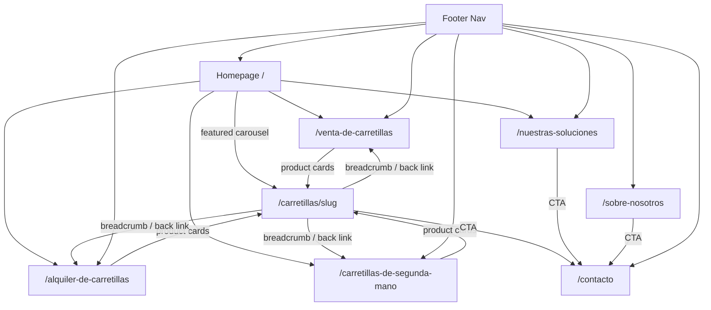

# SEO & Structured Data -- Tekon Website

## Overview

- Local SEO strategy targeting forklift sales, rental, and service queries in Valencia province, Spain
- Every public page carries location-enriched meta tags, LocalBusiness JSON-LD, Open Graph tags, and hreflang
- Product detail pages add Product JSON-LD; the solutions page adds FAQPage JSON-LD
- Astro 5 static rendering means all SEO markup is in the HTML build output -- no client-side rendering dependency
- Sitemap auto-generated by `@astrojs/sitemap`; `robots.txt` blocks `/admin` only

## Key Concepts

- **Local SEO**: Optimizing for location-based search queries (e.g., "alquiler carretillas Valencia") by embedding geographic signals in meta tags, headings, content, and structured data
- **JSON-LD (JavaScript Object Notation for Linked Data)**: A script-based structured data format embedded in `<head>` that search engines parse to understand page content and generate rich results
- **Schema.org**: The vocabulary used inside JSON-LD to describe entities like LocalBusiness, Product, and FAQPage
- **Rich results**: Enhanced search listings (star ratings, FAQ dropdowns, business info panels) triggered by valid structured data
- **hreflang**: An HTML attribute that tells search engines which language and regional variant a page targets
- **Semantic keyword coverage**: Using natural variations of target terms throughout content so search engines understand topical relevance without keyword stuffing

## Target Search Queries

| Query pattern | Example | Pages that target it |
|--------------|---------|---------------------|
| Rental + location | "alquiler carretillas Valencia" | `/alquiler-de-carretillas`, `/` |
| Sales + location | "venta carretillas Valencia" | `/venta-de-carretillas`, `/` |
| Used + location | "carretillas segunda mano Valencia" | `/carretillas-de-segunda-mano` |
| Brand/type + location | "carretillas elevadoras Sueca" | All listing pages, product detail pages |
| Service + location | "reparacion carretillas Valencia" | `/nuestras-soluciones` |
| Generic + location | "montacargas Valencia" | `/`, listing pages |
| Product-specific | "apilador electrico Valencia" | `/carretillas/[slug]` |

## Per-Page SEO Strategy

| Route | `<title>` | `<meta description>` | `<h1>` | JSON-LD types |
|-------|-----------|----------------------|--------|---------------|
| `/` | Carretillas Tekon - Venta, Alquiler y Reparacion de Carretillas en Valencia | Venta, alquiler y reparacion de carretillas elevadoras en Valencia y provincia. Desde 1989. Contacta con Tekon. | Venta, Alquiler y Servicio de Carretillas Elevadoras en Valencia | LocalBusiness |
| `/venta-de-carretillas` | Venta de Carretillas Elevadoras en Valencia \| Tekon | Compra carretillas elevadoras nuevas en Valencia. Apiladores, transpaletas, contrapesadas y mas. Carretillas Tekon, desde 1989. | Venta de Carretillas en Valencia | LocalBusiness |
| `/alquiler-de-carretillas` | Alquiler de Carretillas Elevadoras en Valencia \| Tekon | Alquiler de carretillas elevadoras en Valencia y provincia. Electricas, diesel, contrapesadas. Carretillas Tekon. | Alquiler de Carretillas en Valencia | LocalBusiness |
| `/carretillas-de-segunda-mano` | Carretillas de Segunda Mano en Valencia \| Tekon | Carretillas elevadoras de segunda mano en Valencia. Revisadas y garantizadas. Carretillas Tekon. | Carretillas de Segunda Mano en Valencia | LocalBusiness |
| `/carretillas/[slug]` | {Forklift Name} - {Category} en Valencia \| Tekon | {short_description}. Disponible en Carretillas Tekon, Valencia. | {Forklift Name} | LocalBusiness, Product |
| `/nuestras-soluciones` | Soluciones para Carretillas Elevadoras en Valencia \| Tekon | Reparacion, mantenimiento, electronica y alquiler de carretillas en Valencia. Carretillas Tekon, desde 1989. | Nuestras Soluciones para Carretillas en Valencia | LocalBusiness, FAQPage |
| `/sobre-nosotros` | Sobre Nosotros - Carretillas Tekon \| Valencia | Carretillas Tekon, empresa de venta y alquiler de carretillas elevadoras en Sueca, Valencia. Desde 1989. | Sobre Carretillas Tekon | LocalBusiness |
| `/contacto` | Contacto - Carretillas Tekon \| Valencia | Contacta con Carretillas Tekon en Sueca, Valencia. Telefono, direccion y formulario de contacto. | Contacto | LocalBusiness |
| `/politica-de-privacidad` | Politica de Privacidad \| Carretillas Tekon | Politica de privacidad de Carretillas Tekon. | Politica de Privacidad | (none) |
| `/politica-de-cookies` | Politica de Cookies \| Carretillas Tekon | Politica de cookies de Carretillas Tekon. | Politica de Cookies | (none) |
| `/aviso-legal` | Aviso Legal \| Carretillas Tekon | Aviso legal de Carretillas Tekon. | Aviso Legal | (none) |

## Meta Tags

### Title pattern

- Listing pages: `{Service} de Carretillas Elevadoras en Valencia | Tekon`
- Product detail: `{Forklift Name} - {Category} en Valencia | Tekon`
- Informational pages: `{Page Name} - Carretillas Tekon | Valencia`
- Legal pages: `{Page Name} | Carretillas Tekon`

### Meta description pattern

- Always include location (Valencia, Sueca, or provincia de Valencia)
- Always include the primary service keyword relevant to the page
- Keep under 155 characters
- Include a call-to-action or trust signal ("desde 1989", "contacta")

### Astro Layout component pattern

The `Layout.astro` component accepts title and description as props and renders them in `<head>`:

```astro
---
// src/layouts/Layout.astro
interface Props {
  title: string;
  description: string;
  ogImage?: string;
  jsonLd?: object | object[];
}

const { title, description, ogImage, jsonLd } = Astro.props;
const canonicalUrl = new URL(Astro.url.pathname, Astro.site);
---

<html lang="es" dir="ltr">
<head>
  <meta charset="utf-8" />
  <meta name="viewport" content="width=device-width, initial-scale=1" />

  <title>{title}</title>
  <meta name="description" content={description} />

  <link rel="canonical" href={canonicalUrl} />
  <link rel="alternate" hreflang="es-ES" href={canonicalUrl} />

  <!-- Open Graph -->
  <meta property="og:title" content={title} />
  <meta property="og:description" content={description} />
  <meta property="og:url" content={canonicalUrl} />
  <meta property="og:site_name" content="Carretillas Tekon" />
  <meta property="og:locale" content="es_ES" />
  <meta property="og:type" content="website" />
  {ogImage && <meta property="og:image" content={ogImage} />}

  <!-- Twitter Card -->
  <meta name="twitter:card" content="summary_large_image" />
  <meta name="twitter:title" content={title} />
  <meta name="twitter:description" content={description} />
  {ogImage && <meta name="twitter:image" content={ogImage} />}

  <!-- JSON-LD Structured Data -->
  {jsonLd && (
    Array.isArray(jsonLd)
      ? jsonLd.map(schema => (
          <script type="application/ld+json" set:html={JSON.stringify(schema)} />
        ))
      : <script type="application/ld+json" set:html={JSON.stringify(jsonLd)} />
  )}

  <slot name="head" />
</head>
<body>
  <slot />
</body>
</html>
```

### Page usage example

```astro
---
// src/pages/venta-de-carretillas.astro
import Layout from '../layouts/Layout.astro';
import { localBusinessJsonLd } from '../lib/seo';

const title = "Venta de Carretillas Elevadoras en Valencia | Tekon";
const description = "Compra carretillas elevadoras nuevas en Valencia. Apiladores, transpaletas, contrapesadas y mas. Carretillas Tekon, desde 1989.";
---

<Layout title={title} description={description} jsonLd={localBusinessJsonLd}>
  <h1>Venta de Carretillas en Valencia</h1>
  <!-- page content -->
</Layout>
```

## JSON-LD Structured Data

### LocalBusiness -- every public page (except legal pages)

Injected via the Layout component on all public pages. Defined once in a shared module.

```typescript
// src/lib/seo.ts

export const localBusinessJsonLd = {
  "@context": "https://schema.org",
  "@type": "LocalBusiness",
  "@id": "https://www.carretillastekon.com/#organization",
  "name": "Carretillas Tekon",
  "alternateName": "Tekon",
  "description": "Venta, alquiler y reparacion de carretillas elevadoras en Valencia y provincia. Desde 1989.",
  "url": "https://www.carretillastekon.com",
  "telephone": "+34 96 170 XX XX",  // Replace with actual phone
  "email": "info@carretillastekon.com",
  "foundingDate": "1989",
  "image": "https://www.carretillastekon.com/images/logo-tekon.png",
  "logo": {
    "@type": "ImageObject",
    "url": "https://www.carretillastekon.com/images/logo-tekon.png"
  },
  "address": {
    "@type": "PostalAddress",
    "streetAddress": "Calle XXXXX",  // Replace with actual address
    "addressLocality": "Sueca",
    "addressRegion": "Valencia",
    "postalCode": "46410",
    "addressCountry": "ES"
  },
  "geo": {
    "@type": "GeoCoordinates",
    "latitude": 39.2028,   // Replace with actual coordinates
    "longitude": -0.3117   // Replace with actual coordinates
  },
  "areaServed": {
    "@type": "AdministrativeArea",
    "name": "Provincia de Valencia",
    "containedInPlace": {
      "@type": "Country",
      "name": "Spain"
    }
  },
  "openingHoursSpecification": [
    {
      "@type": "OpeningHoursSpecification",
      "dayOfWeek": ["Monday", "Tuesday", "Wednesday", "Thursday", "Friday"],
      "opens": "08:00",
      "closes": "18:00"
    }
  ],
  "priceRange": "$$",
  "sameAs": [
    // Add social media profile URLs if they exist
  ]
};
```

### Product -- forklift detail pages (`/carretillas/[slug]`)

Generated dynamically for each forklift at build time.

```typescript
// src/lib/seo.ts

export function productJsonLd(forklift: {
  name: string;
  slug: string;
  short_description: string;
  description: string;
  image_url: string;
  category: { name: string };
  available_for_sale: boolean;
  available_for_rental: boolean;
}) {
  return {
    "@context": "https://schema.org",
    "@type": "Product",
    "name": forklift.name,
    "description": forklift.short_description || forklift.description,
    "image": forklift.image_url,
    "url": `https://www.carretillastekon.com/carretillas/${forklift.slug}`,
    "brand": {
      "@type": "Brand",
      "name": "Carretillas Tekon"
    },
    "category": forklift.category.name,
    "offers": {
      "@type": "Offer",
      "availability": forklift.available_for_sale
        ? "https://schema.org/InStock"
        : "https://schema.org/PreOrder",
      "areaServed": {
        "@type": "AdministrativeArea",
        "name": "Provincia de Valencia"
      },
      "seller": {
        "@type": "LocalBusiness",
        "@id": "https://www.carretillastekon.com/#organization"
      }
    },
    "manufacturer": {
      "@type": "Organization",
      "name": "Carretillas Tekon"
    }
  };
}
```

### Product detail page usage

```astro
---
// src/pages/carretillas/[slug].astro
import Layout from '../../layouts/Layout.astro';
import { localBusinessJsonLd, productJsonLd } from '../../lib/seo';

export async function getStaticPaths() {
  const { data: forklifts } = await supabase
    .from('forklifts')
    .select('*, categories(name, slug)')
    .eq('is_published', true);

  return forklifts.map(f => ({
    params: { slug: f.slug },
    props: { forklift: f },
  }));
}

const { forklift } = Astro.props;

const title = `${forklift.name} - ${forklift.category.name} en Valencia | Tekon`;
const description = `${forklift.short_description}. Disponible en Carretillas Tekon, Valencia.`;
const jsonLd = [localBusinessJsonLd, productJsonLd(forklift)];
---

<Layout title={title} description={description} jsonLd={jsonLd} ogImage={forklift.image_url}>
  <h1>{forklift.name}</h1>
  <!-- product detail content -->
</Layout>
```

### FAQPage -- solutions page (`/nuestras-soluciones`)

```typescript
// src/lib/seo.ts

export const faqJsonLd = {
  "@context": "https://schema.org",
  "@type": "FAQPage",
  "mainEntity": [
    {
      "@type": "Question",
      "name": "Cuanto cuesta alquilar una carretilla en Valencia?",
      "acceptedAnswer": {
        "@type": "Answer",
        "text": "El precio del alquiler de carretillas en Valencia depende del tipo de carretilla, la duracion del alquiler y las condiciones especificas. Contacta con Carretillas Tekon para un presupuesto personalizado."
      }
    },
    {
      "@type": "Question",
      "name": "Que tipos de carretillas elevadoras vendeis?",
      "acceptedAnswer": {
        "@type": "Answer",
        "text": "Vendemos apiladores electricos, transpaletas, carretillas contrapesadas electricas y diesel, retractiles y mas. Todas disponibles en nuestra sede de Sueca, Valencia."
      }
    },
    {
      "@type": "Question",
      "name": "Ofreceis servicio de reparacion de carretillas en Valencia?",
      "acceptedAnswer": {
        "@type": "Answer",
        "text": "Si, ofrecemos servicio tecnico y reparacion de carretillas elevadoras en Valencia y provincia. Nuestro equipo cuenta con mas de 30 anos de experiencia desde 1989."
      }
    },
    {
      "@type": "Question",
      "name": "Teneis carretillas de segunda mano?",
      "acceptedAnswer": {
        "@type": "Answer",
        "text": "Si, disponemos de carretillas elevadoras de segunda mano revisadas y garantizadas. Consulta nuestro catalogo o contacta con nosotros para disponibilidad."
      }
    },
    {
      "@type": "Question",
      "name": "Donde estais ubicados?",
      "acceptedAnswer": {
        "@type": "Answer",
        "text": "Carretillas Tekon esta ubicada en Sueca, en la provincia de Valencia. Damos servicio a toda la provincia de Valencia y alrededores."
      }
    }
  ]
};
```

### Solutions page usage

```astro
---
// src/pages/nuestras-soluciones.astro
import Layout from '../layouts/Layout.astro';
import { localBusinessJsonLd, faqJsonLd } from '../lib/seo';

const title = "Soluciones para Carretillas Elevadoras en Valencia | Tekon";
const description = "Reparacion, mantenimiento, electronica y alquiler de carretillas en Valencia. Carretillas Tekon, desde 1989.";
const jsonLd = [localBusinessJsonLd, faqJsonLd];
---

<Layout title={title} description={description} jsonLd={jsonLd}>
  <h1>Nuestras Soluciones para Carretillas en Valencia</h1>
  <!-- service sections -->
  <!-- FAQ section (matching the JSON-LD questions) -->
</Layout>
```

## Open Graph Tags

- Rendered in Layout.astro `<head>` for every page
- `og:type` is `website` for all pages (Product pages could use `product` but `website` is safer for local businesses)
- `og:image` defaults to a branded social sharing image; product detail pages override with the forklift image
- `og:locale` is `es_ES`
- `og:site_name` is `Carretillas Tekon`

### Default OG image

- Create a 1200x630px branded image with the Tekon logo, tagline, and location
- Store at `/public/images/og-default.png`
- Layout falls back to this when no `ogImage` prop is provided

```astro
<!-- In Layout.astro, replace the ogImage conditional -->
<meta property="og:image" content={ogImage || `${Astro.site}images/og-default.png`} />
```

## hreflang

- Single language site: Spanish for Spain (`es-ES`)
- Added via `<link rel="alternate">` in `<head>` on every page
- Also set `<html lang="es">` on the root element

```html
<html lang="es" dir="ltr">
<head>
  <link rel="alternate" hreflang="es-ES" href="https://www.carretillastekon.com/current-path" />
</head>
```

- If the site ever adds Catalan (Valencian) or English versions, additional hreflang entries and an `x-default` entry would be needed

## Sitemap Configuration

### Astro sitemap integration

```bash
npx astro add sitemap
```

```typescript
// astro.config.mjs
import { defineConfig } from 'astro/config';
import react from '@astrojs/react';
import sitemap from '@astrojs/sitemap';
import tailwindcss from '@tailwindcss/vite';

export default defineConfig({
  site: 'https://www.carretillastekon.com',
  integrations: [
    react(),
    sitemap({
      filter: (page) => !page.includes('/admin'),
    }),
  ],
  vite: {
    plugins: [tailwindcss()],
  },
});
```

### What the sitemap includes

- All static pages (`/`, `/venta-de-carretillas`, `/alquiler-de-carretillas`, etc.)
- All generated product detail pages (`/carretillas/[slug]`)
- Excludes `/admin` and all sub-routes via the filter function

### What the sitemap excludes

- `/admin/*` (blocked by filter and robots.txt)
- Any page not generated by Astro's build (there are none in this static site)

## robots.txt

```
# public/robots.txt

User-agent: *
Allow: /
Disallow: /admin
Disallow: /admin/

Sitemap: https://www.carretillastekon.com/sitemap-index.xml
```

- Allows crawling of all public pages
- Blocks the entire `/admin` section
- Points to the sitemap generated by `@astrojs/sitemap`
- File lives at `public/robots.txt` and is served as-is by Astro/Vercel

## Internal Linking Strategy

### Link structure



### Link rules

- **Product cards** on listing pages link to `/carretillas/[slug]`
- **Product detail pages** include a breadcrumb linking back to the relevant listing page (sale, rental, or used)
- **Homepage featured carousel** links each card to its product detail page
- **Homepage service cards** link to the three listing pages
- **Footer** contains a complete navigation with links to all primary pages
- **CTAs** ("Contacta con nosotros", "Solicita presupuesto") on product detail, solutions, and about pages link to `/contacto`
- **Header navigation** provides access to all primary sections

### Anchor text guidelines

- Use descriptive, keyword-rich anchor text: "Ver carretillas en venta" not "Click aqui"
- Breadcrumbs use the page title: "Venta de Carretillas" > "{Forklift Name}"
- Product cards use the forklift name as the primary link text

## Semantic Keyword Strategy

### Core keyword clusters

| Primary term | Variations to include naturally in content |
|-------------|-------------------------------------------|
| carretillas | carretillas elevadoras, carretillas electricas, carretillas diesel, carretillas contrapesadas |
| montacargas | montacargas electricos, montacargas Valencia |
| apiladores | apiladores electricos, apiladores de conductor acompanante |
| transpaletas | transpaletas electricas, transpaletas manuales |
| alquiler | alquiler de carretillas, alquiler a corto plazo, alquiler a largo plazo, renting |
| venta | venta de carretillas, comprar carretillas, carretillas nuevas |
| segunda mano | carretillas de segunda mano, carretillas de ocasion, carretillas usadas |
| Valencia | Valencia, Sueca, provincia de Valencia, Comunidad Valenciana |
| servicio | reparacion, mantenimiento, servicio tecnico, asistencia tecnica |

### Placement strategy

- **H1 tags**: Include primary keyword + location on every listing and informational page
- **Intro paragraphs**: Each listing and content page opens with a 2-3 sentence paragraph using natural keyword variations. These are static Astro content (not inside React islands) so they are always in the HTML
- **Product descriptions**: Include category name and use case keywords
- **FAQ answers**: Naturally embed location and service terms
- **Alt text on images**: Descriptive alt text including forklift type (e.g., "Apilador electrico Tekon S100 en Valencia")

### Example intro paragraph (sales page)

```html
<p>
  Descubre nuestra seleccion de carretillas elevadoras en venta en Valencia.
  Disponemos de apiladores electricos, transpaletas, carretillas contrapesadas
  y montacargas para todo tipo de necesidades logisticas en la provincia de Valencia.
  Carretillas Tekon lleva desde 1989 ofreciendo soluciones de manutencion en Sueca
  y alrededores.
</p>
```

- This paragraph is a static `.astro` component -- it is part of the build output HTML, fully indexable

## Image Optimization for SEO

### Astro Image component

- All forklift images use Astro's `<Image>` component
- Automatically converts to WebP format at build time
- Generates responsive `srcset` for multiple viewport sizes
- Requires `width` and `height` attributes to prevent layout shift (CLS)

```astro
---
import { Image } from 'astro:assets';
---

<Image
  src={forklift.image_url}
  alt={`${forklift.name} - ${forklift.category.name} en Valencia`}
  width={800}
  height={600}
  format="webp"
  quality={80}
/>
```

### Alt text pattern

| Image context | Alt text pattern | Example |
|--------------|-----------------|---------|
| Product card | `{Name} - {Category}` | "S100 - Apilador electrico" |
| Product detail hero | `{Name} - {Category} en Valencia` | "S100 - Apilador electrico en Valencia" |
| Homepage hero | Descriptive scene text | "Carretillas elevadoras en almacen Valencia" |
| Logo | `Carretillas Tekon - Logo` | "Carretillas Tekon - Logo" |

### Image file naming

- Use descriptive, lowercase, hyphenated file names in Supabase Storage
- Example: `apilador-electrico-s100.jpg` instead of `IMG_2847.jpg`
- This is managed through the admin panel image upload -- the admin should generate a slug-based filename

## Performance Targets (SEO-relevant)

| Metric | Target | How achieved |
|--------|--------|-------------|
| Lighthouse Performance | 90+ | Static HTML, edge caching, optimized images |
| Lighthouse SEO | 90+ | Meta tags, structured data, semantic HTML, sitemap |
| Lighthouse Accessibility | 90+ | Alt text, ARIA labels, semantic HTML, color contrast |
| Lighthouse Best Practices | 90+ | HTTPS, no console errors, no deprecated APIs |
| First Contentful Paint (FCP) | < 1.5s | Static HTML from Vercel edge CDN |
| Largest Contentful Paint (LCP) | < 2.5s | Optimized hero images, preload critical assets |
| Cumulative Layout Shift (CLS) | < 0.1 | Explicit image dimensions, no late-injected content |
| Time to Interactive (TTI) | < 3s | Minimal JS on public pages (islands architecture) |

### Why static rendering helps SEO

- Search engine crawlers receive complete HTML with all content, meta tags, and JSON-LD already present
- No JavaScript execution required to see page content
- TTFB is near-instant from Vercel edge
- Core Web Vitals scores are inherently strong with static HTML

## Canonical URLs

- Every page includes `<link rel="canonical">` pointing to its own URL
- Prevents duplicate content issues if pages are accessible via multiple URL patterns
- Generated automatically from `Astro.url.pathname` combined with `Astro.site`

```astro
<link rel="canonical" href={new URL(Astro.url.pathname, Astro.site)} />
```

## seo.ts Module Structure

All SEO helper functions and data live in a single module for maintainability:

```
src/lib/seo.ts
  - localBusinessJsonLd     (constant object, used on all public pages)
  - productJsonLd(forklift)  (function, used on /carretillas/[slug])
  - faqJsonLd                (constant object, used on /nuestras-soluciones)
```

- The Layout.astro component receives JSON-LD objects via the `jsonLd` prop
- Pages import what they need from `src/lib/seo.ts` and pass it to the layout
- This keeps structured data centralized and easy to update

## Constraints

- **No price data in Product JSON-LD**: Tekon does not list prices publicly; the `offers` object uses availability status only, not `price`. Google may not generate price-related rich results
- **JSON-LD must match visible content**: Google requires that structured data reflects what users actually see on the page. FAQ answers in JSON-LD must match the FAQ section visible on `/nuestras-soluciones`
- **LocalBusiness address must be accurate**: The address, phone, and coordinates in JSON-LD must exactly match the Google Business Profile listing to reinforce local SEO signals
- **Product images must be crawlable**: Images stored in Supabase Storage must be publicly accessible URLs. If Supabase Storage uses signed URLs with expiry, they will break in structured data
- **Sitemap regeneration**: Since the site is statically built, the sitemap only updates when the site is rebuilt and deployed. New forklifts added via admin require a rebuild to appear in the sitemap
- **Single language only**: The hreflang setup assumes Spanish (es-ES) only. Adding more languages later requires updating Layout.astro to handle multiple hreflang entries and x-default

## Edge Cases

- **Product page with missing data**: If a forklift lacks `short_description`, the meta description and Product JSON-LD `description` should fall back to a truncated version of `description` (first 155 characters)
- **Very long forklift names**: Title tags should stay under 60 characters. If `{Name} - {Category} en Valencia | Tekon` exceeds 60 characters, truncate the category or omit "en Valencia"
- **Unpublished forklifts**: Product pages for unpublished forklifts should not be generated at build time (`is_published === false`), so they never appear in the sitemap or get indexed
- **Deleted forklifts**: If a previously indexed forklift is removed, the page will 404 after the next build. Google will eventually de-index it. No redirect is needed unless the forklift was moved to a new URL
- **FAQ content changes**: If FAQ questions or answers change on the solutions page, the JSON-LD in `seo.ts` must be updated to match. Consider extracting FAQ data into a shared array used by both the visible FAQ component and the JSON-LD generator
- **Google Business Profile alignment**: The business name, address, and phone in JSON-LD should be identical (character-for-character) to the Google Business Profile to maximize local pack visibility
- **Legal pages excluded from structured data**: Privacy policy, cookie policy, and legal notice pages do not carry LocalBusiness JSON-LD because they are not location-relevant content pages
