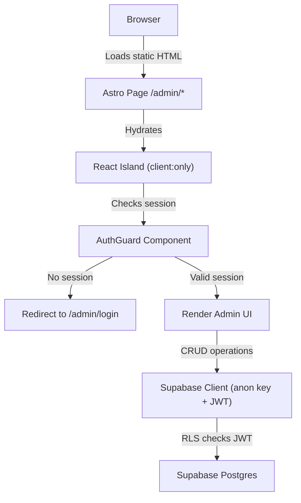
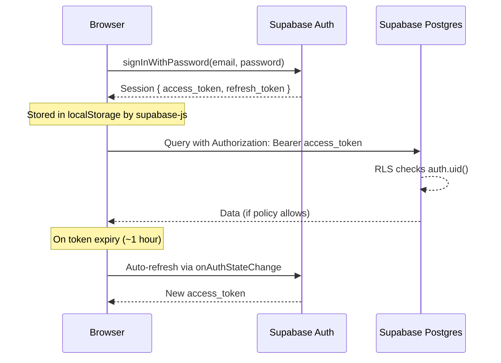

# Supabase Auth + Admin Route Protection

## Overview

- Single admin account protected by Supabase Auth (email + password)
- Admin pages are client-rendered React islands inside Astro (not SSR/SSG)
- Public pages remain fully static; admin section is a separate client-side app
- RLS policies enforce data access at the database level

## Key Concepts

- **Astro SSG constraint**: Astro pre-renders pages at build time; there is no server runtime to check auth. Admin pages must opt out of static rendering entirely by using `client:only="react"` islands.
- **Supabase Auth**: Handles session management, JWT issuance, token refresh, and password hashing. The session is stored in `localStorage` by the Supabase JS client.
- **Anon key vs Service role key**: The anon key is safe to expose in the browser. RLS policies gate what it can access. The service role key bypasses RLS and must only be used server-side (Edge Functions, build scripts).
- **Single admin account**: No registration flow needed. The admin user is created manually via Supabase Dashboard or CLI. The `/admin/login` page only shows email + password fields.

## Architecture



## Auth Flow



## 1. Supabase Auth Setup

### Enable email/password provider

- Supabase Dashboard > Authentication > Providers > Email
- Enable "Email" provider
- Disable "Confirm email" (single admin account, no need for email confirmation)
- Disable "Enable sign up" to prevent unauthorized registration via the API

### Create the admin account

Option A -- Supabase Dashboard:
- Authentication > Users > "Add user"
- Enter admin email and a strong password

Option B -- Supabase CLI:
```sql
-- Run in Supabase SQL Editor
SELECT supabase_auth.create_user(
  '{"email": "admin@carretillastekon.com", "password": "STRONG_PASSWORD", "email_confirm": true}'
);
```

Option C -- JavaScript (run once locally):
```typescript
import { createClient } from '@supabase/supabase-js'

const supabase = createClient(SUPABASE_URL, SUPABASE_SERVICE_ROLE_KEY)

const { data, error } = await supabase.auth.admin.createUser({
  email: 'admin@carretillastekon.com',
  password: 'STRONG_PASSWORD',
  email_confirm: true,
})
```

### Auth settings to configure

| Setting | Value | Reason |
|---------|-------|--------|
| Enable sign up | false | Prevent public registration |
| Confirm email | false | Admin account is pre-confirmed |
| JWT expiry | 3600 (default) | 1 hour, auto-refreshed |
| Site URL | `https://carretillastekon.com` | For redirect URLs |
| Redirect URLs | `https://carretillastekon.com/admin` | Allowed post-auth redirects |

## 2. Auth in Astro (SSG Context)

### Why admin pages cannot be statically rendered

- Astro SSG generates HTML at build time; there is no request/response cycle
- Authentication requires runtime access to `localStorage` (for the session) and network calls to Supabase
- Static HTML cannot conditionally render based on auth state

### Solution: `client:only="react"` islands

Every admin page renders a React component with `client:only="react"`, which skips SSR/SSG entirely and renders only in the browser.

```astro
---
// src/pages/admin/index.astro
// No server-side code needed -- this page is just a shell
import AdminLayout from '../../layouts/AdminLayout.astro'
---

<AdminLayout title="Admin Dashboard">
  <div id="admin-root">
    <!-- React takes over entirely -->
    <AdminDashboard client:only="react" />
  </div>
</AdminLayout>
```

The Astro layout provides the HTML shell (head, meta tags, loading state), while React handles all auth logic and UI rendering client-side.

### Admin layout loading state

Since the React island loads asynchronously, the Astro layout should show a loading skeleton:

```astro
---
// src/layouts/AdminLayout.astro
---
<html>
  <head>
    <title>{Astro.props.title} | Tekon Admin</title>
  </head>
  <body>
    <div id="admin-shell" class="min-h-screen bg-gray-50">
      <!-- Shown while React hydrates -->
      <div class="flex items-center justify-center h-screen" id="loading-fallback">
        <div class="animate-spin h-8 w-8 border-4 border-primary border-t-transparent rounded-full"></div>
      </div>
      <!-- React replaces this -->
      <slot />
    </div>
  </body>
</html>
```

## 3. Route Protection Patterns

### Why not Astro middleware

- Astro middleware runs at build time in SSG mode, not at request time
- There is no server to intercept requests to `/admin/*`
- Even with SSR adapters, client-side auth checks are still needed for SPAs

### Client-side auth guard (recommended approach)

All route protection happens inside React. Every admin page wraps its content in an `AuthGuard` component.

### Static file consideration

- Astro will generate `/admin/index.html`, `/admin/carretillas/index.html`, etc.
- These files are served by Vercel as static assets
- The HTML contains the loading shell + React mount point
- Auth protection happens after React hydrates
- The static HTML shell itself contains no sensitive data

## 4. Auth State Management

### Supabase client singleton

```typescript
// src/lib/supabase.ts
import { createClient } from '@supabase/supabase-js'
import type { Database } from './database.types'

export const supabase = createClient<Database>(
  import.meta.env.PUBLIC_SUPABASE_URL,
  import.meta.env.PUBLIC_SUPABASE_ANON_KEY
)
```

- Use `PUBLIC_` prefix for Astro to expose env vars to client-side code
- The anon key is safe to expose; RLS policies protect data
- Type the client with generated database types for type safety

### Auth context provider

```tsx
// src/components/admin/AuthProvider.tsx
import { createContext, useContext, useEffect, useState } from 'react'
import type { Session, User } from '@supabase/supabase-js'
import { supabase } from '../../lib/supabase'

interface AuthContextType {
  session: Session | null
  user: User | null
  loading: boolean
  signOut: () => Promise<void>
}

const AuthContext = createContext<AuthContextType | undefined>(undefined)

export function AuthProvider({ children }: { children: React.ReactNode }) {
  const [session, setSession] = useState<Session | null>(null)
  const [loading, setLoading] = useState(true)

  useEffect(() => {
    // Get initial session from localStorage
    supabase.auth.getSession().then(({ data: { session } }) => {
      setSession(session)
      setLoading(false)
    })

    // Listen for auth state changes (login, logout, token refresh)
    const { data: { subscription } } = supabase.auth.onAuthStateChange(
      (_event, session) => {
        setSession(session)
      }
    )

    return () => subscription.unsubscribe()
  }, [])

  const signOut = async () => {
    await supabase.auth.signOut()
    window.location.href = '/admin/login'
  }

  return (
    <AuthContext.Provider
      value={{
        session,
        user: session?.user ?? null,
        loading,
        signOut,
      }}
    >
      {children}
    </AuthContext.Provider>
  )
}

export function useAuth() {
  const context = useContext(AuthContext)
  if (context === undefined) {
    throw new Error('useAuth must be used within an AuthProvider')
  }
  return context
}
```

### Key behaviors

- `getSession()` reads the session from `localStorage` on mount (synchronous read, async wrapper)
- `onAuthStateChange` fires on: `SIGNED_IN`, `SIGNED_OUT`, `TOKEN_REFRESHED`, `USER_UPDATED`
- Token refresh is automatic; `supabase-js` handles it transparently
- The `loading` state prevents flash of unauthenticated content

## 5. Login Flow

### Login page implementation

```tsx
// src/components/admin/LoginPage.tsx
import { useState } from 'react'
import { supabase } from '../../lib/supabase'
import { Button } from '../ui/button'
import { Input } from '../ui/input'
import { Label } from '../ui/label'
import { Alert, AlertDescription } from '../ui/alert'

export function LoginPage() {
  const [email, setEmail] = useState('')
  const [password, setPassword] = useState('')
  const [error, setError] = useState<string | null>(null)
  const [loading, setLoading] = useState(false)

  const handleSubmit = async (e: React.FormEvent) => {
    e.preventDefault()
    setError(null)
    setLoading(true)

    const { error } = await supabase.auth.signInWithPassword({
      email,
      password,
    })

    if (error) {
      setError('Credenciales incorrectas. Inténtalo de nuevo.')
      setLoading(false)
      return
    }

    // Redirect to admin dashboard
    window.location.href = '/admin'
  }

  return (
    <div className="flex min-h-screen items-center justify-center bg-gray-50">
      <div className="w-full max-w-sm space-y-6 p-8">
        <div className="text-center">
          <h1 className="text-2xl font-bold">Tekon Admin</h1>
          <p className="text-muted-foreground">Accede al panel de administración</p>
        </div>

        <form onSubmit={handleSubmit} className="space-y-4">
          {error && (
            <Alert variant="destructive">
              <AlertDescription>{error}</AlertDescription>
            </Alert>
          )}

          <div className="space-y-2">
            <Label htmlFor="email">Email</Label>
            <Input
              id="email"
              type="email"
              value={email}
              onChange={(e) => setEmail(e.target.value)}
              required
              autoComplete="email"
            />
          </div>

          <div className="space-y-2">
            <Label htmlFor="password">Contraseña</Label>
            <Input
              id="password"
              type="password"
              value={password}
              onChange={(e) => setPassword(e.target.value)}
              required
              autoComplete="current-password"
            />
          </div>

          <Button type="submit" className="w-full" disabled={loading}>
            {loading ? 'Entrando...' : 'Entrar'}
          </Button>
        </form>
      </div>
    </div>
  )
}
```

### Login page Astro wrapper

```astro
---
// src/pages/admin/login.astro
import BaseLayout from '../../layouts/BaseLayout.astro'
---

<BaseLayout title="Login | Tekon Admin">
  <LoginPage client:only="react" />
</BaseLayout>
```

### Error states to handle

| Error | Message shown |
|-------|-------------|
| Invalid credentials | "Credenciales incorrectas. Inténtalo de nuevo." |
| Network error | "Error de conexión. Comprueba tu conexión a internet." |
| Rate limited | "Demasiados intentos. Espera unos minutos." |

### Redirect after login

- `window.location.href = '/admin'` forces a full page load (clean state)
- Alternative: use `navigate()` from a client-side router if one is added later
- The login page should also check if the user is already authenticated and redirect immediately

```tsx
// Add to LoginPage component
useEffect(() => {
  supabase.auth.getSession().then(({ data: { session } }) => {
    if (session) {
      window.location.href = '/admin'
    }
  })
}, [])
```

## 6. Logout Flow

### Sign out implementation

```tsx
const handleSignOut = async () => {
  await supabase.auth.signOut()
  // Full page redirect to clear React state
  window.location.href = '/admin/login'
}
```

### What `signOut()` does

- Revokes the refresh token on the Supabase server
- Removes session from `localStorage`
- Triggers `onAuthStateChange` with `SIGNED_OUT` event
- After redirect, the login page loads fresh with no session

### Sign out button placement

- In the admin sidebar or header
- Always visible on all admin pages
- Use the `signOut` method from `useAuth()` context

## 7. Auth Guard Component

```tsx
// src/components/admin/AuthGuard.tsx
import { useAuth } from './AuthProvider'

interface AuthGuardProps {
  children: React.ReactNode
}

export function AuthGuard({ children }: AuthGuardProps) {
  const { session, loading } = useAuth()

  // Show loading spinner while checking session
  if (loading) {
    return (
      <div className="flex items-center justify-center h-screen">
        <div className="animate-spin h-8 w-8 border-4 border-primary border-t-transparent rounded-full" />
      </div>
    )
  }

  // Redirect to login if no session
  if (!session) {
    window.location.href = '/admin/login'
    return null
  }

  return <>{children}</>
}
```

### Usage in admin pages

Every admin page component follows this pattern:

```tsx
// src/components/admin/AdminDashboard.tsx
import { AuthProvider } from './AuthProvider'
import { AuthGuard } from './AuthGuard'
import { AdminSidebar } from './AdminSidebar'

export function AdminDashboard() {
  return (
    <AuthProvider>
      <AuthGuard>
        <div className="flex">
          <AdminSidebar />
          <main className="flex-1 p-6">
            <h1 className="text-2xl font-bold">Dashboard</h1>
            {/* Dashboard content */}
          </main>
        </div>
      </AuthGuard>
    </AuthProvider>
  )
}
```

### Component hierarchy

```
AuthProvider          -- provides session context
  AuthGuard           -- redirects if unauthenticated
    AdminSidebar      -- navigation with sign out button
    Page Content      -- uses supabase client for data
```

### Optimization: shared AuthProvider

If using a client-side router within the admin (e.g., React Router), wrap the router with a single `AuthProvider` at the top level instead of repeating it per page. If each admin page is a separate Astro page (separate React islands), each island needs its own `AuthProvider` -- but the session is shared via `localStorage`, so there is no redundant auth check.

## 8. Supabase Client with Auth

### How the authenticated client works

- The Supabase JS client automatically attaches the `Authorization: Bearer <access_token>` header to every request
- After `signInWithPassword()`, the client stores the session and uses it for all subsequent calls
- No additional configuration is needed; the same `supabase` client instance used for login is used for CRUD

### Admin CRUD operations

```typescript
// Forklifts
const { data, error } = await supabase
  .from('forklifts')
  .select('*, categories(name)')
  .order('created_at', { ascending: false })

// Create forklift
const { error } = await supabase
  .from('forklifts')
  .insert({ name, slug, category_id, description, is_published: false })

// Update forklift
const { error } = await supabase
  .from('forklifts')
  .update({ name, description, is_published })
  .eq('id', forkliftId)

// Delete forklift
const { error } = await supabase
  .from('forklifts')
  .delete()
  .eq('id', forkliftId)

// Read inquiries
const { data, error } = await supabase
  .from('inquiries')
  .select('*, forklifts(name)')
  .order('created_at', { ascending: false })

// Mark inquiry as read
const { error } = await supabase
  .from('inquiries')
  .update({ read: true })
  .eq('id', inquiryId)
```

### Image upload with auth

```typescript
const { data, error } = await supabase.storage
  .from('forklift-images')
  .upload(`forklifts/${forkliftId}/${file.name}`, file, {
    cacheControl: '3600',
    upsert: true,
  })

// Get public URL (no auth needed for public bucket)
const { data: { publicUrl } } = supabase.storage
  .from('forklift-images')
  .getPublicUrl(`forklifts/${forkliftId}/${file.name}`)
```

## 9. RLS Integration

### Policy strategy

| Table | Public (anon) | Authenticated (admin) |
|-------|--------------|----------------------|
| categories | SELECT | SELECT, INSERT, UPDATE, DELETE |
| forklifts | SELECT (where `is_published = true`) | SELECT, INSERT, UPDATE, DELETE |
| forklift_specs | SELECT | SELECT, INSERT, UPDATE, DELETE |
| inquiries | INSERT (for contact form) | SELECT, UPDATE, DELETE |

### SQL policies

```sql
-- Categories: public read, admin full access
CREATE POLICY "Public can read categories"
  ON categories FOR SELECT
  USING (true);

CREATE POLICY "Admin full access to categories"
  ON categories FOR ALL
  USING (auth.role() = 'authenticated');

-- Forklifts: public read published only, admin full access
CREATE POLICY "Public can read published forklifts"
  ON forklifts FOR SELECT
  USING (is_published = true);

CREATE POLICY "Admin full access to forklifts"
  ON forklifts FOR ALL
  USING (auth.role() = 'authenticated');

-- Forklift specs: public read, admin full access
CREATE POLICY "Public can read specs"
  ON forklift_specs FOR SELECT
  USING (true);

CREATE POLICY "Admin full access to specs"
  ON forklift_specs FOR ALL
  USING (auth.role() = 'authenticated');

-- Inquiries: public can insert (contact form), admin can read/update/delete
CREATE POLICY "Public can submit inquiries"
  ON inquiries FOR INSERT
  WITH CHECK (true);

CREATE POLICY "Admin can manage inquiries"
  ON inquiries FOR ALL
  USING (auth.role() = 'authenticated');
```

### Important RLS notes

- `auth.role()` returns `'authenticated'` for any logged-in user and `'anon'` for unauthenticated requests
- Since there is only one admin account, checking `auth.role() = 'authenticated'` is sufficient
- If multiple admin accounts are needed in the future, add an `admin` role check via `auth.jwt() ->> 'role'` or a custom `user_roles` table
- Public pages use the anon key and hit the `SELECT` policies only
- The admin panel uses the same anon key but with a valid session, which passes the `authenticated` check

### Service role key usage

- Only used in Supabase Edge Functions (e.g., sending email notifications via Resend)
- Never exposed to the browser
- Bypasses all RLS policies
- Stored as `SUPABASE_SERVICE_ROLE_KEY` environment variable on server-side only

## 10. Session Persistence

### How sessions persist across page navigations

- `supabase-js` stores the session in `localStorage` under the key `sb-<project-ref>-auth-token`
- When a user navigates from `/admin/carretillas` to `/admin/consultas`, Astro loads a new static HTML page
- The new React island mounts, `AuthProvider` calls `getSession()`, which reads from `localStorage`
- The user remains logged in without re-authenticating

### Token refresh

- Access tokens expire after 1 hour (default, configurable in Supabase)
- `supabase-js` automatically refreshes the token when it detects expiry
- `onAuthStateChange` fires with `TOKEN_REFRESHED` event
- If the refresh token is also expired (default: 1 week), the user is signed out
- In `AuthProvider`, the `onAuthStateChange` listener updates the session state on refresh

### Edge case: stale session on page load

```tsx
// In AuthProvider, handle the case where getSession returns an expired session
useEffect(() => {
  supabase.auth.getSession().then(({ data: { session }, error }) => {
    if (error) {
      // Session invalid or expired, clear it
      supabase.auth.signOut()
      setSession(null)
    } else {
      setSession(session)
    }
    setLoading(false)
  })
  // ...onAuthStateChange listener
}, [])
```

### Session timeline

| Event | Timing | Behavior |
|-------|--------|----------|
| Login | t=0 | Session stored in localStorage |
| Access token expires | t+1h | Auto-refreshed by supabase-js |
| Refresh token expires | t+1w | User signed out, must re-login |
| Tab closed and reopened | Any | Session restored from localStorage |
| Browser cleared | Any | Session lost, must re-login |

## 11. robots.txt

### Block admin routes from search engines

```
// public/robots.txt
User-agent: *
Allow: /
Disallow: /admin/

Sitemap: https://carretillastekon.com/sitemap-index.xml
```

- Place in `public/robots.txt` (Astro copies `public/` to build output as-is)
- Blocks all crawlers from indexing `/admin/*` routes
- The `Allow: /` is implicit but included for clarity
- Sitemap URL points to Astro's auto-generated sitemap

### Additional protection: noindex meta tag

Add a `noindex` meta tag to the admin layout as a belt-and-suspenders approach:

```html
<meta name="robots" content="noindex, nofollow" />
```

This goes in `AdminLayout.astro` so it applies to every admin page.

## Constraints

- No SSR adapter needed; admin pages are fully client-side React
- Single admin account only; no role system, no multi-user
- The anon key is public; all security depends on RLS policies being correct
- Admin pages will have a brief loading flash while React hydrates and checks auth
- If JavaScript is disabled, admin pages will not work (expected for an admin panel)
- Sign-up is disabled at the Supabase level; the only way to create the admin account is via Dashboard, CLI, or service role key

## File Reference

| File | Purpose |
|------|---------|
| `src/lib/supabase.ts` | Supabase client singleton |
| `src/components/admin/AuthProvider.tsx` | Auth context + session state |
| `src/components/admin/AuthGuard.tsx` | Route protection wrapper |
| `src/components/admin/LoginPage.tsx` | Login form |
| `src/layouts/AdminLayout.astro` | HTML shell for admin pages |
| `src/pages/admin/login.astro` | Login page (Astro wrapper) |
| `src/pages/admin/index.astro` | Dashboard page (Astro wrapper) |
| `public/robots.txt` | Block admin from crawlers |
| `supabase/migrations/XXX_rls_policies.sql` | RLS policy definitions |
