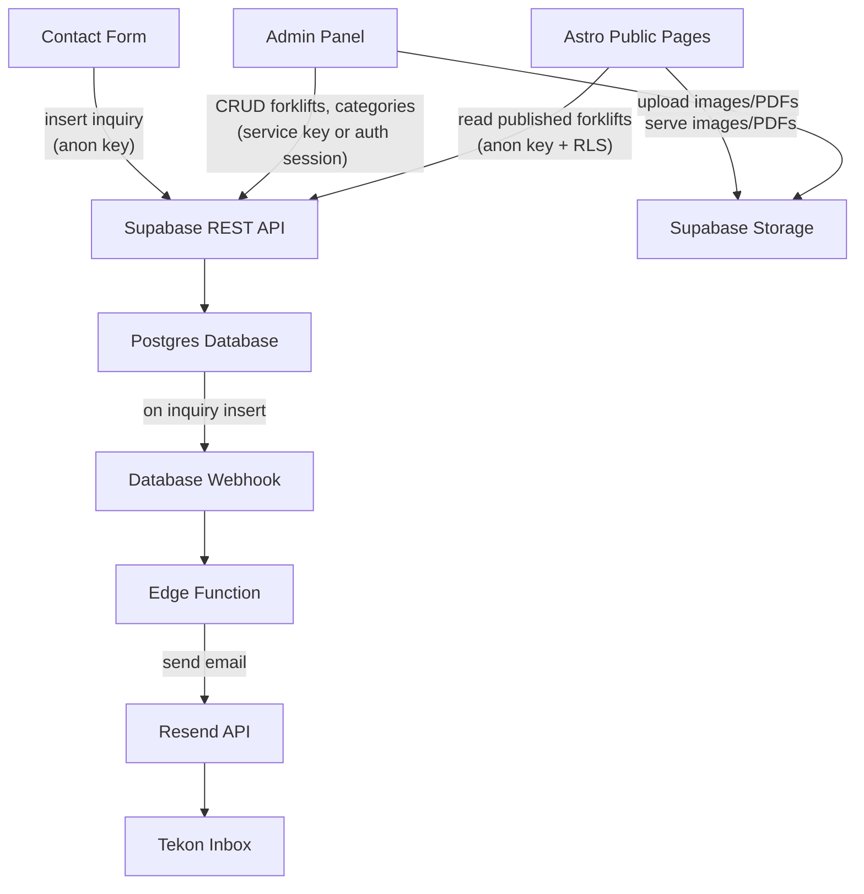
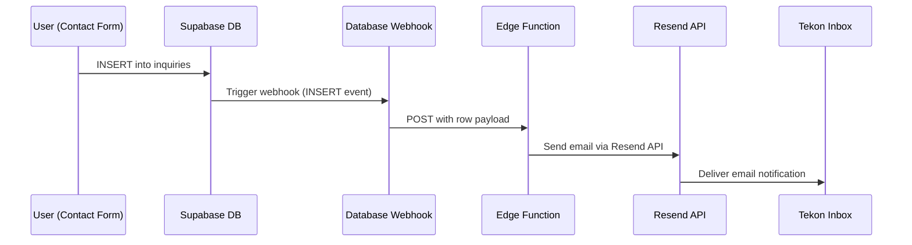

# Supabase Setup & Schema -- Tekon Website Rewrite

## Overview

- Supabase provides the Postgres database, authentication, file storage, and edge functions for the Tekon forklift catalog site
- Free tier covers all needs: database, 1GB storage, auth, edge functions
- Four tables: `categories`, `forklifts`, `forklift_specs`, `inquiries`
- Full-text search in Spanish via tsvector generated column with GIN index
- Contact form submissions trigger email notifications via Database Webhook + Edge Function + Resend

## Key Concepts

- **Supabase project**: A hosted Postgres instance with REST API, Auth, Storage, and Edge Functions built in
- **Anon key**: Public API key embedded in client-side code, safe to expose because RLS restricts access
- **Service role key**: Server-side only key that bypasses RLS, used in edge functions and server routes
- **Row Level Security (RLS)**: Postgres policies that control which rows each role can read/write
- **Database Webhook**: Supabase feature that sends an HTTP POST to an Edge Function when a row is inserted/updated/deleted
- **Edge Function**: Deno-based serverless function hosted on Supabase infrastructure
- **tsvector**: Postgres data type for full-text search, supports language-specific stemming and ranking

## Data Flow



---

## 1. Supabase Project Setup

### Creating the project

- Go to [supabase.com](https://supabase.com) and create a new project
- Region: choose the closest to Valencia, Spain (e.g., `eu-west-1` or `eu-central-1`)
- Set a strong database password and save it securely
- Wait for the project to provision (usually under 2 minutes)

### Getting credentials

- Navigate to **Settings > API** in the Supabase dashboard
- Collect these values:

| Variable | Where to find | Usage |
|----------|--------------|-------|
| `SUPABASE_URL` | Settings > API > Project URL | Base URL for all API calls |
| `SUPABASE_ANON_KEY` | Settings > API > `anon` `public` | Client-side, subject to RLS |
| `SUPABASE_SERVICE_ROLE_KEY` | Settings > API > `service_role` `secret` | Server-side only, bypasses RLS |
| `RESEND_API_KEY` | Resend dashboard | Used in Edge Function for email |

### Environment variables

- Store in `.env` at project root (gitignored)
- Also set in Vercel project settings for production
- Also set in Supabase Edge Function secrets for the Resend key

```bash
# .env (local development)
SUPABASE_URL=https://your-project-id.supabase.co
SUPABASE_ANON_KEY=eyJhbGciOiJIUzI1NiIs...
SUPABASE_SERVICE_ROLE_KEY=eyJhbGciOiJIUzI1NiIs...
RESEND_API_KEY=re_xxxxxxxxxx
```

---

## 2. SQL Migrations

### Directory structure

```
supabase/
  migrations/
    20260304000000_create_categories.sql
    20260304000001_create_forklifts.sql
    20260304000002_create_forklift_specs.sql
    20260304000003_create_inquiries.sql
    20260304000004_enable_rls.sql
    20260304000005_create_storage_buckets.sql
    20260304000006_seed_data.sql
```

### Using Supabase CLI

```bash
# Install CLI
brew install supabase/tap/supabase

# Link to remote project
supabase link --project-ref your-project-id

# Create a new migration
supabase migration new create_categories

# Apply all pending migrations to remote
supabase db push

# Pull remote schema to local (if schema was changed via dashboard)
supabase db pull

# Reset local database (destructive, for development only)
supabase db reset

# Start local Supabase for development
supabase start
```

- Each migration file is a plain SQL file
- Migrations run in alphabetical order (timestamp prefix ensures correct ordering)
- Never edit a migration that has already been applied; create a new one instead

---

## 3. Full Schema SQL

### categories

```sql
CREATE TABLE categories (
  id uuid PRIMARY KEY DEFAULT gen_random_uuid(),
  name text NOT NULL,
  slug text NOT NULL UNIQUE,
  sort_order int NOT NULL DEFAULT 0
);

CREATE INDEX idx_categories_slug ON categories (slug);
CREATE INDEX idx_categories_sort ON categories (sort_order);
```

### forklifts

```sql
CREATE TABLE forklifts (
  id uuid PRIMARY KEY DEFAULT gen_random_uuid(),
  name text NOT NULL,
  slug text NOT NULL UNIQUE,
  category_id uuid NOT NULL REFERENCES categories (id) ON DELETE RESTRICT,
  description text NOT NULL DEFAULT '',
  short_description text NOT NULL DEFAULT '',
  image_url text,
  catalog_pdf_url text,
  available_for_sale boolean NOT NULL DEFAULT false,
  available_for_rental boolean NOT NULL DEFAULT false,
  available_as_used boolean NOT NULL DEFAULT false,
  is_published boolean NOT NULL DEFAULT false,
  created_at timestamptz NOT NULL DEFAULT now(),
  updated_at timestamptz NOT NULL DEFAULT now(),
  fts tsvector GENERATED ALWAYS AS (
    setweight(to_tsvector('spanish', coalesce(name, '')), 'A') ||
    setweight(to_tsvector('spanish', coalesce(short_description, '')), 'B') ||
    setweight(to_tsvector('spanish', coalesce(description, '')), 'C')
  ) STORED
);

CREATE INDEX idx_forklifts_slug ON forklifts (slug);
CREATE INDEX idx_forklifts_category ON forklifts (category_id);
CREATE INDEX idx_forklifts_published ON forklifts (is_published) WHERE is_published = true;
CREATE INDEX idx_forklifts_sale ON forklifts (available_for_sale) WHERE available_for_sale = true;
CREATE INDEX idx_forklifts_rental ON forklifts (available_for_rental) WHERE available_for_rental = true;
CREATE INDEX idx_forklifts_used ON forklifts (available_as_used) WHERE available_as_used = true;
CREATE INDEX idx_forklifts_fts ON forklifts USING GIN (fts);

-- Auto-update updated_at on row modification
CREATE OR REPLACE FUNCTION update_updated_at()
RETURNS TRIGGER AS $$
BEGIN
  NEW.updated_at = now();
  RETURN NEW;
END;
$$ LANGUAGE plpgsql;

CREATE TRIGGER set_updated_at
  BEFORE UPDATE ON forklifts
  FOR EACH ROW
  EXECUTE FUNCTION update_updated_at();
```

### forklift_specs

```sql
CREATE TABLE forklift_specs (
  id uuid PRIMARY KEY DEFAULT gen_random_uuid(),
  forklift_id uuid NOT NULL REFERENCES forklifts (id) ON DELETE CASCADE,
  spec_name text NOT NULL,
  spec_value text NOT NULL,
  spec_unit text,
  sort_order int NOT NULL DEFAULT 0
);

CREATE INDEX idx_specs_forklift ON forklift_specs (forklift_id);
CREATE INDEX idx_specs_name ON forklift_specs (spec_name);
```

**Design note:** Specs are stored as rows (EAV pattern) so admin users can add/remove spec types without schema changes. Filters on product pages are generated dynamically from `SELECT DISTINCT spec_name FROM forklift_specs`.

### inquiries

```sql
CREATE TABLE inquiries (
  id uuid PRIMARY KEY DEFAULT gen_random_uuid(),
  name text NOT NULL,
  email text NOT NULL,
  message text NOT NULL,
  forklift_id uuid REFERENCES forklifts (id) ON DELETE SET NULL,
  read boolean NOT NULL DEFAULT false,
  created_at timestamptz NOT NULL DEFAULT now()
);

CREATE INDEX idx_inquiries_read ON inquiries (read) WHERE read = false;
CREATE INDEX idx_inquiries_created ON inquiries (created_at DESC);
```

---

## 4. Full-Text Search Setup

### How it works

- The `fts` column is a `tsvector` generated column that combines `name`, `short_description`, and `description`
- Uses the `'spanish'` text search configuration for proper Spanish stemming (e.g., "elevadoras" matches "elevadora")
- Weights prioritize matches: `A` = name (highest), `B` = short_description, `C` = description
- A GIN index on `fts` makes searches fast even on larger datasets

### Querying full-text search

```sql
-- Basic search
SELECT id, name, slug, short_description, image_url,
       ts_rank(fts, query) AS rank
FROM forklifts,
     plainto_tsquery('spanish', 'carretilla electrica') AS query
WHERE fts @@ query
  AND is_published = true
ORDER BY rank DESC
LIMIT 8;
```

### Querying via Supabase client (JavaScript)

```typescript
const { data, error } = await supabase
  .from('forklifts')
  .select('id, name, slug, short_description, image_url')
  .eq('is_published', true)
  .textSearch('fts', searchTerm, {
    type: 'plain',
    config: 'spanish',
  })
  .limit(8);
```

### Including category name in search

- The generated column only includes forklift fields
- To also match on category name, use an RPC function:

```sql
CREATE OR REPLACE FUNCTION search_forklifts(search_query text)
RETURNS TABLE (
  id uuid,
  name text,
  slug text,
  short_description text,
  image_url text,
  category_name text,
  rank real
) AS $$
BEGIN
  RETURN QUERY
  SELECT
    f.id, f.name, f.slug, f.short_description, f.image_url,
    c.name AS category_name,
    ts_rank(
      f.fts || to_tsvector('spanish', coalesce(c.name, '')),
      plainto_tsquery('spanish', search_query)
    ) AS rank
  FROM forklifts f
  JOIN categories c ON f.category_id = c.id
  WHERE (f.fts || to_tsvector('spanish', coalesce(c.name, '')))
        @@ plainto_tsquery('spanish', search_query)
    AND f.is_published = true
  ORDER BY rank DESC
  LIMIT 8;
END;
$$ LANGUAGE plpgsql STABLE;
```

```typescript
// Call from client
const { data } = await supabase.rpc('search_forklifts', {
  search_query: userInput,
});
```

---

## 5. Row Level Security (RLS)

### Enable RLS on all tables

```sql
ALTER TABLE categories ENABLE ROW LEVEL SECURITY;
ALTER TABLE forklifts ENABLE ROW LEVEL SECURITY;
ALTER TABLE forklift_specs ENABLE ROW LEVEL SECURITY;
ALTER TABLE inquiries ENABLE ROW LEVEL SECURITY;
```

### Policy summary

| Table | Operation | Who | Condition |
|-------|-----------|-----|-----------|
| `categories` | SELECT | `anon`, `authenticated` | Always |
| `categories` | INSERT, UPDATE, DELETE | `authenticated` | Always (admin only) |
| `forklifts` | SELECT | `anon`, `authenticated` | `is_published = true` for `anon`; all for `authenticated` |
| `forklifts` | INSERT, UPDATE, DELETE | `authenticated` | Always (admin only) |
| `forklift_specs` | SELECT | `anon`, `authenticated` | If parent forklift is published for `anon`; all for `authenticated` |
| `forklift_specs` | INSERT, UPDATE, DELETE | `authenticated` | Always (admin only) |
| `inquiries` | INSERT | `anon` | Always (anyone can submit a contact form) |
| `inquiries` | SELECT, UPDATE | `authenticated` | Always (admin reads/marks as read) |
| `inquiries` | DELETE | `authenticated` | Always (admin can delete) |

### Policy SQL

```sql
-- categories: public read
CREATE POLICY "categories_select" ON categories
  FOR SELECT USING (true);

-- categories: authenticated write
CREATE POLICY "categories_insert" ON categories
  FOR INSERT TO authenticated WITH CHECK (true);
CREATE POLICY "categories_update" ON categories
  FOR UPDATE TO authenticated USING (true) WITH CHECK (true);
CREATE POLICY "categories_delete" ON categories
  FOR DELETE TO authenticated USING (true);

-- forklifts: public read (published only for anon)
CREATE POLICY "forklifts_select_anon" ON forklifts
  FOR SELECT TO anon USING (is_published = true);
CREATE POLICY "forklifts_select_auth" ON forklifts
  FOR SELECT TO authenticated USING (true);

-- forklifts: authenticated write
CREATE POLICY "forklifts_insert" ON forklifts
  FOR INSERT TO authenticated WITH CHECK (true);
CREATE POLICY "forklifts_update" ON forklifts
  FOR UPDATE TO authenticated USING (true) WITH CHECK (true);
CREATE POLICY "forklifts_delete" ON forklifts
  FOR DELETE TO authenticated USING (true);

-- forklift_specs: public read (if parent forklift is published)
CREATE POLICY "specs_select_anon" ON forklift_specs
  FOR SELECT TO anon
  USING (
    EXISTS (
      SELECT 1 FROM forklifts
      WHERE forklifts.id = forklift_specs.forklift_id
        AND forklifts.is_published = true
    )
  );
CREATE POLICY "specs_select_auth" ON forklift_specs
  FOR SELECT TO authenticated USING (true);

-- forklift_specs: authenticated write
CREATE POLICY "specs_insert" ON forklift_specs
  FOR INSERT TO authenticated WITH CHECK (true);
CREATE POLICY "specs_update" ON forklift_specs
  FOR UPDATE TO authenticated USING (true) WITH CHECK (true);
CREATE POLICY "specs_delete" ON forklift_specs
  FOR DELETE TO authenticated USING (true);

-- inquiries: anon can insert (contact form)
CREATE POLICY "inquiries_insert_anon" ON inquiries
  FOR INSERT TO anon WITH CHECK (true);

-- inquiries: authenticated full access
CREATE POLICY "inquiries_select_auth" ON inquiries
  FOR SELECT TO authenticated USING (true);
CREATE POLICY "inquiries_update_auth" ON inquiries
  FOR UPDATE TO authenticated USING (true) WITH CHECK (true);
CREATE POLICY "inquiries_delete_auth" ON inquiries
  FOR DELETE TO authenticated USING (true);
```

### Security notes

- The `anon` role is what unauthenticated users get when using the anon key
- The `authenticated` role applies to logged-in users (the Tekon admin)
- Since there is only one admin account, no per-user filtering is needed
- The service role key bypasses RLS entirely and should never be exposed client-side
- RLS policies on `forklift_specs` check the parent `forklifts` row, so unpublished forklift specs are not leaked

---

## 6. Supabase Storage

### Bucket setup

Create two buckets in the Supabase dashboard or via SQL:

```sql
-- Create buckets (run via Supabase dashboard SQL editor)
INSERT INTO storage.buckets (id, name, public)
VALUES
  ('forklift-images', 'forklift-images', true),
  ('forklift-catalogs', 'forklift-catalogs', true);
```

| Bucket | Purpose | Public | Max file size |
|--------|---------|--------|--------------|
| `forklift-images` | Forklift photos (JPG, PNG, WebP) | Yes | 5MB |
| `forklift-catalogs` | PDF spec sheets / catalogs | Yes | 10MB |

### Storage policies

```sql
-- Anyone can read images (public bucket)
CREATE POLICY "public_read_images" ON storage.objects
  FOR SELECT TO anon, authenticated
  USING (bucket_id = 'forklift-images');

-- Only authenticated users can upload/update/delete images
CREATE POLICY "auth_upload_images" ON storage.objects
  FOR INSERT TO authenticated
  WITH CHECK (bucket_id = 'forklift-images');
CREATE POLICY "auth_update_images" ON storage.objects
  FOR UPDATE TO authenticated
  USING (bucket_id = 'forklift-images');
CREATE POLICY "auth_delete_images" ON storage.objects
  FOR DELETE TO authenticated
  USING (bucket_id = 'forklift-images');

-- Same pattern for catalogs
CREATE POLICY "public_read_catalogs" ON storage.objects
  FOR SELECT TO anon, authenticated
  USING (bucket_id = 'forklift-catalogs');
CREATE POLICY "auth_upload_catalogs" ON storage.objects
  FOR INSERT TO authenticated
  WITH CHECK (bucket_id = 'forklift-catalogs');
CREATE POLICY "auth_update_catalogs" ON storage.objects
  FOR UPDATE TO authenticated
  USING (bucket_id = 'forklift-catalogs');
CREATE POLICY "auth_delete_catalogs" ON storage.objects
  FOR DELETE TO authenticated
  USING (bucket_id = 'forklift-catalogs');
```

### Upload pattern (admin)

```typescript
// Upload image from admin form
const file = event.target.files[0];
const fileExt = file.name.split('.').pop();
const fileName = `${forkliftSlug}-${Date.now()}.${fileExt}`;

const { data, error } = await supabase.storage
  .from('forklift-images')
  .upload(fileName, file, {
    cacheControl: '3600',
    upsert: false,
  });

// Get public URL to store in forklifts.image_url
const { data: { publicUrl } } = supabase.storage
  .from('forklift-images')
  .getPublicUrl(fileName);
```

### Download/display pattern (public)

```typescript
// The image_url stored in the database is the full public URL
// Use directly in  tags or Astro <Image> component


// PDF download link
<a href={forklift.catalog_pdf_url} download>
  Descargar ficha tecnica
</a>
```

### Storage limits (free tier)

- 1GB total storage
- 2GB bandwidth per month
- With ~30 forklifts, each with one image (~200KB optimized) and one PDF (~1MB), total is ~36MB, well within limits

---

## 7. Database Webhooks

### Purpose

- When a new row is inserted into `inquiries`, automatically send an email notification to the Tekon inbox
- Configured in the Supabase dashboard under **Database > Webhooks**

### Setup steps

1. Go to **Database > Webhooks** in the Supabase dashboard
2. Click **Create a new webhook**
3. Configure:

| Setting | Value |
|---------|-------|
| Name | `on_inquiry_created` |
| Table | `inquiries` |
| Events | `INSERT` |
| Type | Supabase Edge Function |
| Edge Function | `send-inquiry-email` |
| HTTP Headers | `Authorization: Bearer <SUPABASE_SERVICE_ROLE_KEY>` |

### How it works



### Webhook payload structure

The webhook sends a JSON payload with the new row data:

```json
{
  "type": "INSERT",
  "table": "inquiries",
  "record": {
    "id": "uuid-here",
    "name": "Juan Garcia",
    "email": "juan@example.com",
    "message": "Estoy interesado en el modelo S100...",
    "forklift_id": "uuid-or-null",
    "read": false,
    "created_at": "2026-03-04T10:00:00Z"
  },
  "schema": "public",
  "old_record": null
}
```

---

## 8. Edge Functions

### send-inquiry-email function

```
supabase/functions/send-inquiry-email/index.ts
```

```typescript
import { serve } from 'https://deno.land/std@0.168.0/http/server.ts';
import { createClient } from 'https://esm.sh/@supabase/supabase-js@2';

const RESEND_API_KEY = Deno.env.get('RESEND_API_KEY')!;
const SUPABASE_URL = Deno.env.get('SUPABASE_URL')!;
const SUPABASE_SERVICE_ROLE_KEY = Deno.env.get('SUPABASE_SERVICE_ROLE_KEY')!;

serve(async (req) => {
  try {
    const payload = await req.json();
    const inquiry = payload.record;

    // Optionally fetch forklift name if forklift_id is present
    let forkliftName = '';
    if (inquiry.forklift_id) {
      const supabase = createClient(SUPABASE_URL, SUPABASE_SERVICE_ROLE_KEY);
      const { data } = await supabase
        .from('forklifts')
        .select('name')
        .eq('id', inquiry.forklift_id)
        .single();
      forkliftName = data?.name ?? '';
    }

    const subject = forkliftName
      ? `Nueva consulta sobre ${forkliftName} - ${inquiry.name}`
      : `Nueva consulta de ${inquiry.name}`;

    const htmlBody = `
      <h2>Nueva consulta recibida</h2>
      <p><strong>Nombre:</strong> ${inquiry.name}</p>
      <p><strong>Email:</strong> ${inquiry.email}</p>
      ${forkliftName ? `<p><strong>Producto:</strong> ${forkliftName}</p>` : ''}
      <p><strong>Mensaje:</strong></p>
      <p>${inquiry.message}</p>
      <hr />
      <p style="color: #888; font-size: 12px;">
        Recibido el ${new Date(inquiry.created_at).toLocaleString('es-ES')}
      </p>
    `;

    const res = await fetch('https://api.resend.com/emails', {
      method: 'POST',
      headers: {
        'Content-Type': 'application/json',
        Authorization: `Bearer ${RESEND_API_KEY}`,
      },
      body: JSON.stringify({
        from: 'Tekon Web <noreply@carretillastekon.com>',
        to: ['info@carretillastekon.com'],
        subject,
        html: htmlBody,
      }),
    });

    const resData = await res.json();

    return new Response(JSON.stringify(resData), {
      status: res.ok ? 200 : 500,
      headers: { 'Content-Type': 'application/json' },
    });
  } catch (error) {
    return new Response(JSON.stringify({ error: error.message }), {
      status: 500,
      headers: { 'Content-Type': 'application/json' },
    });
  }
});
```

### Deployment

```bash
# Set the Resend API key as a secret
supabase secrets set RESEND_API_KEY=re_xxxxxxxxxx

# Deploy the function
supabase functions deploy send-inquiry-email

# Test locally
supabase functions serve send-inquiry-email --env-file .env
```

### Resend configuration

- Verify the sending domain (`carretillastekon.com`) in the Resend dashboard by adding DNS records
- Until the domain is verified, use the default Resend sandbox domain for testing
- Free tier: 3,000 emails/month (more than enough for contact form inquiries)

---

## 9. Supabase Client Setup

### Install dependencies

```bash
npm install @supabase/supabase-js
```

### Client file: `src/lib/supabase.ts`

```typescript
import { createClient } from '@supabase/supabase-js';

// PUBLIC_ prefix required for Astro to expose vars to client-side code
const supabaseUrl = import.meta.env.PUBLIC_SUPABASE_URL;
const supabaseAnonKey = import.meta.env.PUBLIC_SUPABASE_ANON_KEY;

// Public client (used in React islands and public pages)
// Uses anon key, subject to RLS policies
export const supabase = createClient(supabaseUrl, supabaseAnonKey);
```

### Server-side client: `src/lib/supabase-server.ts`

```typescript
import { createClient } from '@supabase/supabase-js';

const supabaseUrl = import.meta.env.SUPABASE_URL;
const supabaseServiceKey = import.meta.env.SUPABASE_SERVICE_ROLE_KEY;

// Server client (used in Astro server routes and SSR pages)
// Uses service role key, bypasses RLS
// NEVER import this file in client-side code
export const supabaseAdmin = createClient(supabaseUrl, supabaseServiceKey);
```

### When to use which client

| Client | Key | RLS | Usage |
|--------|-----|-----|-------|
| `supabase` | Anon key | Enforced | Public pages, React islands, contact form submissions |
| `supabaseAdmin` | Service role key | Bypassed | Astro server routes for pre-rendering, admin API routes |

### Astro environment variable configuration

In `astro.config.mjs`, Supabase variables need the `SUPABASE_` prefix and must be set in `.env`:

```
# .env
SUPABASE_URL=https://your-project.supabase.co
SUPABASE_ANON_KEY=eyJ...
SUPABASE_SERVICE_ROLE_KEY=eyJ...
```

For client-side access (React islands), variables must use the `PUBLIC_` prefix:

```
# .env
PUBLIC_SUPABASE_URL=https://your-project.supabase.co
PUBLIC_SUPABASE_ANON_KEY=eyJ...
```

Update the client file accordingly:

```typescript
// For client-side usage in React islands
const supabaseUrl = import.meta.env.PUBLIC_SUPABASE_URL;
const supabaseAnonKey = import.meta.env.PUBLIC_SUPABASE_ANON_KEY;
```

---

## 10. Seed Data

### Approach

- The current WordPress site has ~20-30 forklift products across several categories
- Seed data will be manually extracted and structured as SQL INSERTs or a JSON file
- Run seed script after initial schema migration

### Seed migration file

```sql
-- supabase/migrations/20260304000006_seed_data.sql

-- Categories (extracted from current site sections)
INSERT INTO categories (name, slug, sort_order) VALUES
  ('Apiladores electricos', 'apiladores-electricos', 1),
  ('Carretillas contrabalanceadas', 'carretillas-contrabalanceadas', 2),
  ('Transpaletas electricas', 'transpaletas-electricas', 3),
  ('Recogepedidos', 'recogepedidos', 4),
  ('Retractiles', 'retractiles', 5),
  ('Carretillas todoterreno', 'carretillas-todoterreno', 6);

-- Forklifts (example entry)
INSERT INTO forklifts (
  name, slug, category_id, description, short_description,
  available_for_sale, available_for_rental, is_published
) VALUES (
  'S100',
  's100',
  (SELECT id FROM categories WHERE slug = 'apiladores-electricos'),
  'Apilador electrico con capacidad nominal de 1000 kg...',
  'Apilador electrico compacto, ideal para almacenes con pasillos estrechos.',
  true, true, true
);

-- Specs for the above forklift
INSERT INTO forklift_specs (forklift_id, spec_name, spec_value, spec_unit, sort_order) VALUES
  ((SELECT id FROM forklifts WHERE slug = 's100'), 'Capacidad nominal', '1000', 'kg', 1),
  ((SELECT id FROM forklifts WHERE slug = 's100'), 'Altura de elevacion', '3000', 'mm', 2),
  ((SELECT id FROM forklifts WHERE slug = 's100'), 'Tipo de alimentacion', 'Electrico', NULL, 3);
```

### Data extraction strategy

1. Scrape or manually copy product data from the current WordPress site
2. Structure as SQL INSERT statements in the seed migration
3. Upload images to Supabase Storage and record the public URLs
4. Update `image_url` and `catalog_pdf_url` fields after uploads
5. Verify all products appear correctly on the dev site before going live

### Image migration

```bash
# Download images from current site
curl -O https://www.carretillastekon.com/wp-content/uploads/product-image.jpg

# Upload to Supabase Storage via CLI
supabase storage cp product-image.jpg ss:///forklift-images/s100.jpg
```

Or upload programmatically with a script:

```typescript
import { createClient } from '@supabase/supabase-js';
import fs from 'fs';

const supabase = createClient(SUPABASE_URL, SUPABASE_SERVICE_ROLE_KEY);

const files = fs.readdirSync('./seed-images');
for (const file of files) {
  const buffer = fs.readFileSync(`./seed-images/${file}`);
  await supabase.storage
    .from('forklift-images')
    .upload(file, buffer, { contentType: 'image/jpeg' });
}
```

---

## Constraints & Limits (Free Tier)

| Resource | Free Tier Limit | Expected Usage |
|----------|----------------|----------------|
| Database size | 500MB | Under 10MB (text data + indexes) |
| Storage | 1GB | ~36MB (30 images + 30 PDFs) |
| Storage bandwidth | 2GB/month | Low traffic site, well within |
| Edge Function invocations | 500K/month | Only on inquiry insert, negligible |
| Auth users | Unlimited | 1 admin user |
| Resend emails | 3,000/month | Contact form only, likely under 50/month |

---

## Troubleshooting

| Issue | Cause | Fix |
|-------|-------|-----|
| "permission denied for table" | RLS enabled but no matching policy | Check that the correct role (`anon` or `authenticated`) has a policy for the operation |
| Search returns no results | Wrong language config or empty tsvector | Verify `'spanish'` config, check that `name`/`description` are not empty |
| Images not loading | Storage bucket not set to public | Set `public: true` on the bucket or add a SELECT policy for `anon` |
| Webhook not firing | Webhook not enabled or wrong table | Check Database > Webhooks in dashboard, verify table and event type |
| Edge Function errors | Missing secrets | Run `supabase secrets list` to verify `RESEND_API_KEY` is set |
| `updated_at` not changing | Trigger not created | Run the `update_updated_at` trigger migration |
